# 01 — Architecture Overview

## Plain-English Overview

Nexal is a document study tool where users upload PDFs, highlight text, and chat with an AI about the content. The application is built with two separate servers — a Next.js frontend (that also handles its own API routes), and an Express.js backend — that share the same codebase but store data in two completely different ways. This split is a known architectural gap, not an intentional design.

---

## System Architecture Diagram

```mermaid
flowchart TD
    subgraph Browser["Browser (Client)"]
        UI["React Pages\n(src/app/*)"]
        IDB["IndexedDB\n(offline fallback)"]
    end

    subgraph NextServer["Next.js Server (same process)"]
        Pages["Page Routes\n/login, /signup, /storage\n/workspace/[id]"]
        NextAPI["Next.js API Routes\n/api/upload\n/api/ai/generate\n/api/highlights\n/api/document\n/api/documents/*\n/api/folders"]
        DataDir["data/\n  db.json\n  uploads/<id>\n  embeddings/<id>.json"]
    end

    subgraph ExpressServer["Express Server (port 5000)"]
        AuthRoutes["POST /api/auth/register\nPOST /api/auth/login"]
        DocRoutes["GET/POST/PUT/DELETE\n/api/documents"]
        FolderRoutes["/api/folders"]
        HlRoutes["/api/highlights"]
        SocketIO["Socket.io\n(real-time highlights)"]
        UploadsDir["backend/src/uploads/"]
    end

    subgraph MongoDB["MongoDB (Atlas or local)"]
        UserCol["users collection"]
        DocCol["documents collection"]
        FolderCol["folders collection"]
        HlCol["highlights collection"]
        RoadmapCol["studyroadmaps collection"]
    end

    subgraph GHModels["GitHub Models API"]
        Chat["GPT-4o-mini\nchat/completions"]
        Embed["text-embedding-3-small\nembeddings"]
    end

    UI -->|"fetch() Next routes"| NextAPI
    UI -->|"fetch() Express routes\n(auth, storage page)"| ExpressServer
    UI <-->|"Socket.io"| SocketIO
    UI <-->|"Read/write"| IDB

    NextAPI -->|"fs.readFileSync/writeFileSync"| DataDir
    NextAPI -->|"embed query"| Embed
    NextAPI -->|"LLM call"| Chat

    ExpressServer --> MongoDB
    ExpressServer -->|"multer disk storage"| UploadsDir

    style DataDir fill:#2a2a00,stroke:#888
    style UploadsDir fill:#2a2a00,stroke:#888
    style MongoDB fill:#003300,stroke:#4ade80
    style GHModels fill:#001133,stroke:#60a5fa
```



> **Key observation:** The dashed gap in the middle is real. The Next.js API routes and the Express backend do **not** communicate with each other. They have separate storage systems and separate document IDs. This is the most important architectural fact about this project.

---

## Code Walk-Through

### Where each server starts

**Next.js** is started with `npm run frontend:dev` (defined in `package.json`):
```json
"frontend:dev": "next dev"
```
Next.js automatically discovers every file named `route.ts` inside `src/app/api/` and turns it into an HTTP endpoint.

**Express** is started with `npm run backend:dev`:
```json
"backend:dev": "nodemon backend/src/server.js"
```
`server.js` creates an HTTP server, attaches Socket.io, and listens on port 5000.

Both can be started together with:
```json
"dev": "concurrently \"npm run backend:dev\" \"npm run frontend:dev\""
```

### The two data stores

**System A — Next.js + flat file** (`data/db.json`):
```ts
// src/app/api/upload/route.ts
const DB_FILE = path.join(process.cwd(), "data", "db.json");
const db = JSON.parse(fs.readFileSync(DB_FILE, "utf-8"));
db.documents.push(newDoc);
fs.writeFileSync(DB_FILE, JSON.stringify(db, null, 2));
```
This is a plain JSON file on disk used as a database substitute. Used by: `/api/upload`, `/api/highlights`, `/api/documents/*`, `/api/folders`.

**System B — Express + MongoDB** (`backend/`):
```js
// backend/src/config/db.js
const uri = process.env.MONGO_URI || '';
await mongoose.connect(uri);
```
A proper MongoDB database with Mongoose schemas. Used by: auth (login/signup), the storage page document list, and the Socket.io server.

### The workspace AI flow (System A)

When a user opens a document workspace, the URL is:
```
/workspace/<docId>?url=/api/document?id=<docId>&name=<filename>
```
Every AI action calls `/api/ai/generate` (a Next.js route), which in turn calls the GitHub Models API. The `docId` from the URL is sent with each AI request so the RAG pipeline can find the correct embeddings file at `data/embeddings/<docId>.json`.

### Socket.io (real-time highlights)

The Express server runs Socket.io for multi-user highlight broadcasting:
```js
// backend/src/server.js
socket.on('new-highlight', ({ documentId, highlight, user }) => {
  io.in(documentId).emit('receive-highlight', { highlight, user });
});
```
The frontend connects to the Express server **specifically for Socket.io**, even though everything else AI-related goes through Next.js API routes:
```ts
// src/app/workspace/[id]/page.tsx line 398
const socket = io(process.env.NEXT_PUBLIC_API_URL || "http://localhost:5000");
```

### IndexedDB (offline fallback)

The browser's built-in IndexedDB is used as a local backup for highlights and document blobs:
```ts
// src/utils/indexedDB.ts — called in workspace page
fetch(`/api/highlights?docId=${docId}`)
  .catch(async () => {
    const { getLocalHighlights } = await import("../../../utils/indexedDB");
    const localHighlights = await getLocalHighlights(docId);
    if (localHighlights) setHighlights(localHighlights);
  });
```
If the server is unreachable (e.g. deployed on Vercel where the filesystem is read-only), highlights fall back to what's stored in the browser.

---

## Concepts

> **Next.js App Router**
> Next.js is a React framework that runs on a Node.js server. In the "App Router" model (used here), any file named `route.ts` inside `src/app/api/` becomes an HTTP endpoint automatically — no Express needed for those routes. Files named `page.tsx` become rendered web pages. The same Next.js process handles both the HTML pages and the API calls.

> **Express.js**
> Express is a minimal Node.js HTTP server framework. You write `router.get('/path', handler)` to respond to HTTP requests. Unlike Next.js, it has no automatic file-based routing — you register every route manually. Here it's used for auth and document management because it was built first, as a separate "backend."

> **Concurrently**
> `concurrently` is an npm package that runs multiple terminal commands at the same time. `"dev": "concurrently \"npm run backend:dev\" \"npm run frontend:dev\""` starts both servers in one terminal window.

> **Socket.io**
> Socket.io is a library for real-time, bidirectional communication between browser and server. Unlike HTTP (request → response → done), a Socket.io connection stays open. When any user adds a highlight, the server immediately pushes it to every other user in the same document room without them having to ask.

---

## Why This Way, Not Another Way

| Decision | What was built | Alternative | Trade-off |
|---|---|---|---|
| Two separate servers | Next.js + Express running separately | One unified Express server, or Next.js only | Historical: backend was built first; merging would require migrating all routes |
| Flat-file db.json | JSON file as database | SQLite, or just using MongoDB for everything | db.json is zero-config and works locally, but breaks on Vercel (serverless, read-only filesystem) |
| `concurrently` in one repo | Monorepo, single package.json | Separate repos for frontend/backend | Simpler for a solo developer; harder to scale independently |
| Next.js API routes for AI | AI routes live inside Next.js | Dedicated microservice or backend route | Keeps AI code close to the frontend; no cross-origin issues |

---

## Likely Interview Questions

**Q: Why do you have two backends — Next.js API routes and Express?**
> The Express backend was built first as a standalone REST API with MongoDB. When I added the AI features, I put them directly in Next.js API routes to keep them close to the frontend and avoid CORS complexity. In hindsight, they should be unified — I've documented this as a known gap.

**Q: What does the Next.js API route `/api/upload` do that the Express backend doesn't?**
> The Next.js route handles the actual workspace flow — it saves the PDF to `data/uploads/`, triggers text extraction and embedding, and returns the URL that the workspace page uses. The Express backend's upload route saves to `backend/src/uploads/` and records metadata in MongoDB, but it's used by the storage page and doesn't connect to the AI pipeline.

**Q: How does Socket.io fit in? Why not polling?**
> Socket.io maintains a persistent WebSocket connection between each browser tab and the Express server. When a user adds a highlight, it's broadcast instantly to everyone else viewing the same document. With polling, users would need to ask the server every few seconds "any new highlights?" — wasteful and slower. Socket.io pushes updates immediately.

**Q: What happens if the Express server is down?**
> The workspace AI features still work because they go entirely through Next.js API routes. Auth (login/signup) would fail since that's Express-only. Highlights would fall back to IndexedDB — the browser's local storage — so existing highlights are still visible offline.

**Q: What is `concurrently` and why do you need it?**
> `concurrently` lets me run `next dev` and `nodemon backend/src/server.js` at the same time from a single `npm run dev` command. In production you'd deploy them separately — Next.js to Vercel and Express to Render, for example.

**Q: Where is user data actually stored in this project?**
> It depends on the feature. Authentication data (users) lives in MongoDB via the Express backend. Document metadata and highlights for the AI workspace live in `data/db.json`, a flat JSON file. Embedded vectors live in `data/embeddings/<id>.json`. Actual PDF files for the workspace live in `data/uploads/`. There's also a browser-side IndexedDB as a fallback. This fragmentation is a known architectural issue I'd address by unifying everything through the Express + MongoDB path.
