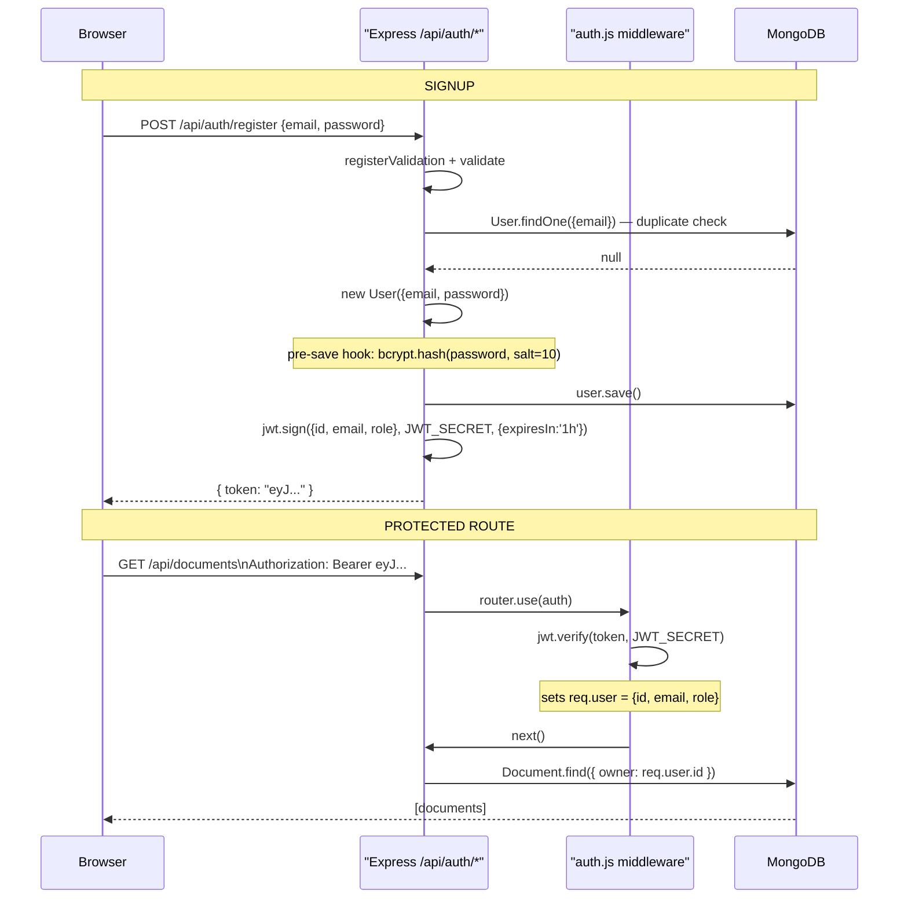

# 02 — Authentication Flow

## Plain-English Overview

When a user registers or logs in, the Express backend checks their credentials, hashes their password with bcrypt, and issues a JWT (a digitally signed token proving who they are). The browser sends this token with every subsequent request to protected routes. The server verifies the signature without a database lookup — making the system stateless.

---

## Sequence Diagram



---

## Code Walk-Through

### Registration — `backend/src/routes/auth.js`

```js
router.post('/register', registerValidation, validate, async (req, res, next) => {
  const { email, password } = req.body;
  const existing = await User.findOne({ email });
  if (existing) return res.status(409).json({ error: 'User already exists' });
  const user = new User({ email, password });
  await user.save();
  const token = signToken({ id: user._id, email: user.email, role: user.role });
  res.status(201).json({ token });
});
```

- `registerValidation, validate` — two middleware functions that validate the request before the handler runs. If email is invalid or password too short, they send a 400 response and the handler never executes.
- `User.findOne({ email })` — queries MongoDB; returns `null` if no existing user.
- `new User(...)` + `await user.save()` — triggers the Mongoose pre-save hook (password hashing happens here).
- `signToken(...)` — creates a JWT signed with `JWT_SECRET`.

### Password hashing — `backend/src/models/User.js`

```js
UserSchema.pre('save', async function (next) {
  if (!this.isModified('password')) return next();
  const salt = await bcrypt.genSalt(10);
  this.password = await bcrypt.hash(this.password, salt);
  next();
});
```

This Mongoose pre-save hook runs automatically before every `.save()`. Cost factor 10 means bcrypt performs 2^10 = 1024 iterations — expensive enough to slow brute-force attacks, fast enough for normal login (~100ms). The salt is embedded in the output hash, so `bcrypt.compare` can extract it automatically.

### JWT signing — `backend/src/config/jwt.js`

```js
return jwt.sign(payload, process.env.JWT_SECRET, { expiresIn: '1h' });
```

Produces a string like `eyJhbGciOiJIUzI1NiJ9.eyJpZCI6Ii4uLiJ9.SIG`. Three parts: header (algorithm), payload (user data), signature (HMAC-SHA256 of header+payload using `JWT_SECRET`).

### Auth middleware — `backend/src/middleware/auth.js`

```js
return jwt.verify(token, process.env.JWT_SECRET);
// sets req.user = { id, email, role }
```

`jwt.verify` recomputes the HMAC and checks it matches the token's signature. No database lookup. If the signature matches and the token hasn't expired, `req.user` is set.

### Frontend — `src/app/login/page.tsx`

```ts
const res = await fetch(
  `${process.env.NEXT_PUBLIC_API_URL || "http://localhost:5000"}/api/auth/login`,
  { method: "POST", body: JSON.stringify({ email, password }) }
);
```

`NEXT_PUBLIC_API_URL` is the Express server address. The `NEXT_PUBLIC_` prefix makes it available in the browser bundle (not secret). After receiving the token, the app stores it for use in the `Authorization: Bearer <token>` header on subsequent requests.

---

## Concepts

> **bcrypt Hashing**
> Hashing is a one-way function: you can't reverse a hash to get the original password. bcrypt adds a random "salt" before hashing so two identical passwords produce different hashes, defeating precomputed lookup tables. The cost factor makes it deliberately slow — each increment doubles compute time, keeping pace with faster hardware.

> **JWT Structure**
> A JWT is `header.payload.signature` — all base64url-encoded. The header names the algorithm. The payload holds user data (ID, role, expiry). The signature is `HMAC(header + payload, secret)`. Anyone can read the payload (it's not encrypted), but cannot forge a valid signature without the secret. The server verifies by recomputing the HMAC itself.

> **Stateless Authentication**
> Session auth requires the server to store session data and look it up on every request. JWT auth is stateless: the token carries all needed info, and the server only needs to verify the signature. Trade-off: you can't invalidate a JWT before it expires (no server-side record to delete).

> **Middleware Pattern (Express)**
> A middleware is a function `(req, res, next)` that runs in a chain before the route handler. `router.use(auth)` applies the auth check to all routes below it in the file. If verification fails, it calls `res.status(401).json(...)` and skips `next()` — the actual route handler never runs.

---

## Why This Way, Not Another Way

| Decision | Built | Alternative | Trade-off |
|---|---|---|---|
| JWT (stateless) | `jwt.sign/verify` | Session cookies + server-side store | JWT scales better (no shared session DB), but tokens can't be revoked early |
| bcrypt cost 10 | `genSalt(10)` | Argon2, or cost 12 | Cost 10 is the recommended default; Argon2 is theoretically stronger but bcrypt is universally available |
| 1-hour expiry | `expiresIn: '1h'` | Refresh token pattern | Simpler; proper production systems pair short-lived access tokens with long-lived refresh tokens |
| Mongoose pre-save hook | Hash in model | Hash manually per route | Pre-save ensures hashing happens regardless of which code path calls `.save()` |
| Next.js AI routes unprotected | No auth on `/api/ai/generate` | Verify JWT in each Next handler | Known gap — Next routes don't share the Express middleware chain |

---

## Likely Interview Questions

**Q: How does bcrypt work and why not SHA-256?**
> bcrypt uses a key derivation function with a configurable cost factor that makes it deliberately slow. SHA-256 is designed to be fast — great for checksums, terrible for passwords because attackers can compute billions of SHA-256 hashes per second with a GPU. At bcrypt cost 10, each hash takes ~100ms, making brute-force attacks impractical.

**Q: Can anyone read the contents of a JWT?**
> Yes — the header and payload are base64url-encoded, not encrypted. Anyone with the token can decode and read the user ID and role. The signature proves the token wasn't tampered with, but doesn't hide the payload. Sensitive data like passwords should never go in a JWT.

**Q: What happens when a JWT expires?**
> `jwt.verify` throws a `TokenExpiredError`. The auth middleware returns 401. Currently there's no refresh token flow, so the user must log in again. A production system would issue a short-lived access token paired with a longer-lived refresh token.

**Q: What does `router.use(auth)` do?**
> It registers the auth function as middleware for every route defined after that line in the same Express router. Each request to `/api/documents` passes through `auth` first — the JWT is verified and `req.user` is populated before the handler runs.

**Q: Why are the Next.js AI routes not protected by the same JWT auth?**
> Express middleware only applies to Express routes. The Next.js API routes run in a completely separate process. To add auth there, I'd need to import `jsonwebtoken` and call `jwt.verify` manually in each Next route handler, sharing the `JWT_SECRET` environment variable. That's a known security gap I haven't addressed yet.
