# 03 — File Upload and Storage

## Plain-English Overview

Nexal has two completely separate file upload systems that were built at different times and never unified. One is a lightweight Next.js API route that saves files directly to disk with no authentication — used by the AI workspace. The other is an Express route using multer, protected by JWT, that stores files in a different folder and records metadata in MongoDB — used by the storage page.

---

## Diagram: Both Upload Paths

```mermaid
flowchart TD
    subgraph PathA["System A — Home Page Upload (no auth)"]
        A1["src/app/page.tsx\nuser drags or selects file"]
        A2["fetch POST /api/upload\n(Next.js API route)"]
        A3["src/app/api/upload/route.ts\nreads file.arrayBuffer()"]
        A4["fs.writeFileSync\ndata/uploads/timestamp-random"]
        A5["data/db.json\ndocuments array push"]
        A6["RAG pipeline\ndata/embeddings/docId.json"]
        A7["return { docId, url, filename }"]
        A8["navigate to /workspace/docId"]
    end

    subgraph PathB["System B — Storage Page Upload (JWT required)"]
        B1["src/app/storage/page.tsx\nuser clicks upload"]
        B2["fetch POST {NEXT_PUBLIC_API_URL}/api/documents\n(Express route)"]
        B3["backend/src/routes/documents.js\nauth middleware checks JWT"]
        B4["multer diskStorage\nbackend/src/uploads/timestamp_name.pdf"]
        B5["MongoDB documents collection\nnew Document({title, owner, filePath})"]
        B6["return saved Document object"]
    end

    A1 --> A2 --> A3 --> A4 --> A5
    A3 --> A6
    A4 --> A7 --> A8

    B1 --> B2 --> B3 --> B4 --> B5 --> B6

    style PathA fill:#0a1a0a,stroke:#4ade80
    style PathB fill:#0a0a1a,stroke:#60a5fa
```



> **These two systems do not share data.** A file uploaded via Path A is invisible to MongoDB. A file uploaded via Path B cannot be opened in the AI workspace. This is the central architectural gap in the project.

---

## Code Walk-Through

### System A — `src/app/api/upload/route.ts`

**Reading the file:**
```ts
const formData = await req.formData();
const file = formData.get("file") as File;
const bytes = await file.arrayBuffer();
const buffer = Buffer.from(bytes);
```
`formData()` parses a multipart/form-data request (the standard encoding for file uploads). `arrayBuffer()` gives the raw binary content. `Buffer.from(bytes)` converts it to a Node.js Buffer for `fs` operations.

**Generating the unique ID:**
```ts
const uniqueSuffix = `${Date.now()}-${Math.round(Math.random() * 1e9)}`;
const filename = uniqueSuffix;
```
The filename has no extension — the file is stored as a raw binary blob. When served back via `/api/document`, the `Content-Type: application/pdf` header tells the browser how to interpret it.

**Saving to disk:**
```ts
const uploadsDir = path.join(process.cwd(), "data", "uploads");
if (!fs.existsSync(uploadsDir)) fs.mkdirSync(uploadsDir, { recursive: true });
const filePath = path.join(uploadsDir, filename);
fs.writeFileSync(filePath, buffer);
```
`process.cwd()` is the project root directory. `{ recursive: true }` creates parent directories if they don't exist. `writeFileSync` blocks the Node.js event loop while writing — acceptable here for simplicity.

**Writing metadata to db.json:**
```ts
const DB_FILE = path.join(process.cwd(), "data", "db.json");
const db = JSON.parse(fs.readFileSync(DB_FILE, "utf-8"));
const newDoc = {
  id: uniqueSuffix,
  name: file.name,
  size: `${sizeMb} MB`,
  type: "PDF",
  folderId: null,
  uploadedAt: new Date().toISOString()
};
db.documents.push(newDoc);
fs.writeFileSync(DB_FILE, JSON.stringify(db, null, 2));
```
The entire JSON file is read, modified in memory, and written back. This is simple but has a race condition: two simultaneous uploads could both read the old file, both push their document, and one would overwrite the other's addition.

**RAG pipeline triggered here** (after file save):
```ts
try {
  const text = await extractTextFromPdf(buffer);
  const chunkTexts = chunkText(text);
  const embeddings = await embedTexts(chunkTexts);
  const chunks = chunkTexts.map((t, i) => ({ id: `${uniqueSuffix}-${i}`, text: t, embedding: embeddings[i] }));
  saveDocEmbeddings(uniqueSuffix, chunks);
} catch (err) {
  console.error("Embedding generation failed (upload still succeeds):", err);
}
```
The `try/catch` ensures that even if embedding fails (network error, API rate limit), the upload response is still sent successfully.

### System A — Serving the file — `src/app/api/document/route.ts`

```ts
const filePath = path.join(process.cwd(), "data", "uploads", id);
const fileBuffer = fs.readFileSync(filePath);
return new NextResponse(fileBuffer, {
  headers: {
    "Content-Type": "application/pdf",
    "Content-Disposition": "inline",
  }
});
```
Reads the stored binary and returns it with the PDF content type. `inline` means the browser displays it rather than downloading it.

### System B — `backend/src/routes/documents.js`

**Multer configuration:**
```js
const storage = multer.diskStorage({
  destination: (req, file, cb) => {
    const uploadPath = path.join(__dirname, '..', 'uploads');
    fs.mkdirSync(uploadPath, { recursive: true });
    cb(null, uploadPath);
  },
  filename: (req, file, cb) => {
    const timestamp = Date.now();
    const safeName = file.originalname.replace(/\s+/g, '_');
    cb(null, `${timestamp}_${safeName}`);
  },
});
const upload = multer({ storage, fileFilter: (req, file, cb) => {
  if (file.mimetype !== 'application/pdf') return cb(new Error('Only PDF files are allowed'));
  cb(null, true);
}});
```
Multer is middleware that intercepts multipart/form-data requests and writes files to disk. `destination` sets the folder. `filename` controls the saved name. `fileFilter` rejects non-PDF files before writing.

**Upload route:**
```js
router.post('/', upload.single('file'), async (req, res, next) => {
  const doc = new Document({
    title: title || req.file.originalname,
    owner: req.user.id,  // populated by auth middleware
    folder: folder || null,
    filePath: req.file.path,
  });
  await doc.save();
  res.status(201).json(doc);
});
```
`upload.single('file')` processes a single file from the `file` form field. After multer runs, `req.file.path` is the absolute path on disk. This path is stored in MongoDB as `filePath` — the Express server uses it later to stream the file back.

**File deletion:**
```js
router.delete('/:id', async (req, res, next) => {
  const doc = await Document.findOneAndDelete({ _id: req.params.id, owner: req.user.id });
  fs.unlinkSync(doc.filePath);
  res.json({ message: 'Document deleted' });
});
```
When deleting, the MongoDB record is removed AND the file is deleted from disk with `fs.unlinkSync`. Note: System A's delete route (in Next.js) doesn't clean up the disk file — a gap.

### IndexedDB fallback — `src/utils/indexedDB.ts`

```ts
export async function saveLocalDocument(id: string, name: string, size: string, fileData: Blob) {
  const db = await initDB();
  const store = db.transaction("documents", "readwrite").objectStore("documents");
  store.put({ id, name, size, fileData, uploadedAt: new Date().toISOString() });
}
```
The browser stores a copy of the PDF file as a Blob in IndexedDB. When the workspace loads, if the server URL fails (e.g. Vercel deployment where filesystem is ephemeral), it falls back to this local copy:
```ts
if (urlParam.startsWith("indexeddb://")) {
  const blob = await getLocalDocumentFile(localDocId);
  const objectUrl = URL.createObjectURL(blob);
  setUrl(objectUrl);
}
```

---

## Concepts

> **multipart/form-data**
> HTTP request bodies can have different formats ("Content-Type"). JSON is `application/json`. File uploads use `multipart/form-data`, which encodes binary data alongside text fields in a single request body, with each part separated by a boundary string. The browser sets this automatically when you use `<input type="file">`.

> **Multer**
> Multer is Express middleware for handling `multipart/form-data`. Without it, `req.body` would be empty for file upload requests. Multer parses the multipart body, optionally saves files to disk or memory, and makes them available at `req.file` (single file) or `req.files` (multiple).

> **MIME Type**
> A MIME type is a label like `application/pdf` or `image/png` that tells systems what kind of data a file contains. The `Content-Type` header on an HTTP response tells the browser how to handle the body. System A doesn't check MIME type on upload (any file is accepted). System B checks `file.mimetype !== 'application/pdf'` and rejects non-PDFs.

> **File System Operations (fs)**
> Node.js's built-in `fs` module provides functions to read and write files on disk. `readFileSync`/`writeFileSync` block the event loop until the operation completes (synchronous). For a low-traffic application this is fine; a high-traffic server would prefer async `readFile`/`writeFile` to avoid blocking other requests.

> **IndexedDB**
> A browser-side database built into every modern browser. Unlike `localStorage` (which only stores strings and has a ~5MB limit), IndexedDB stores any JavaScript value including Blobs (binary data), has no practical size limit, and supports indexed queries. It's asynchronous and uses callback-based or Promise-based APIs.

---

## Why This Way, Not Another Way

| Decision | Built | Alternative | Trade-off |
|---|---|---|---|
| Flat-file db.json for System A | `fs.writeFileSync` JSON | Use MongoDB for everything | Zero config for local dev, but breaks on Vercel (no persistent filesystem) |
| No file type check in System A | Accepts any file | Check MIME type like System B | Oversight — System B correctly rejects non-PDFs |
| Separate upload folders | `data/uploads/` vs `backend/src/uploads/` | Single uploads directory | Result of building two systems independently |
| Synchronous fs operations | `writeFileSync` | Async `writeFile` + await | Simpler code; acceptable for low concurrency |
| No cloud storage | Files on local disk | AWS S3, Cloudinary | Local disk is free and instant; breaks for multi-server deployment or Vercel |
| No deduplication | Same file uploaded twice creates two records | Hash file contents, deduplicate | Not needed at current scale |

---

## Likely Interview Questions

**Q: What is multer and why do you need it?**
> Multer is Express middleware that parses `multipart/form-data` requests — the format browsers use for file uploads. Without it, `req.body` is empty when a file is sent. Multer reads the multipart body, saves the file to disk (or memory), and makes it available at `req.file` so the route handler can access the path and metadata.

**Q: Why do you have two separate upload systems?**
> They were built at different times for different purposes. The Express backend with multer and MongoDB was the original backend for a full auth-protected CRUD system. When I added the AI workspace, I needed a simpler upload flow that didn't require login, so I built a separate Next.js API route writing to `data/db.json`. Unifying them is the next architectural improvement.

**Q: What's the difference between how System A and System B store files?**
> System A stores the raw binary at `data/uploads/<timestamp-random>` (no extension) and records metadata in a JSON file. System B uses multer to store files at `backend/src/uploads/<timestamp>_<originalname>.pdf` and records metadata in MongoDB with a reference to the file path. System B also enforces PDF-only uploads and requires authentication.

**Q: What happens to disk files when a System B document is deleted?**
> The route calls `fs.unlinkSync(doc.filePath)` after removing the MongoDB record, so the file is deleted from disk. System A's delete path only removes the entry from `db.json` — the binary file stays on disk. That's a bug worth fixing.

**Q: Why use `Content-Disposition: inline` when serving the PDF?**
> `inline` tells the browser to display the file in the browser window rather than triggering a download. `attachment` would force a download with a Save dialog. For the PDF viewer component, we want the browser to load it as a URL, so `inline` is correct.

**Q: What is IndexedDB and why does the project use it?**
> IndexedDB is a built-in browser database that can store binary data (Blobs) without a size limit. The project saves a copy of each PDF in IndexedDB as a fallback for environments where the server filesystem is ephemeral (like Vercel serverless). When the workspace page loads and the server-side URL fails, it reads the PDF directly from the browser's local storage.
