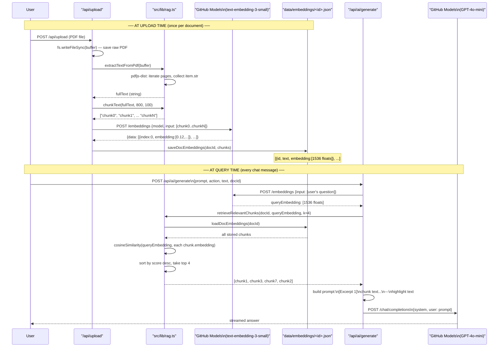

# 04 — RAG Pipeline

## Plain-English Overview

RAG (Retrieval-Augmented Generation) grounds an AI's answers in actual document content rather than general world knowledge. When a PDF is uploaded, its text is extracted, split into small chunks, and each chunk is converted into a vector (a list of numbers that represents meaning). When a user asks a question, that question is also converted to a vector, the most semantically similar chunks are found by comparing vectors, and those chunks are injected into the prompt sent to the LLM.

---

## Sequence Diagram



---

## Code Walk-Through

### Step 1: Text Extraction — `src/lib/rag.ts`

```ts
import * as pdfjsLib from "pdfjs-dist/legacy/build/pdf.mjs";

export async function extractTextFromPdf(buffer: Buffer): Promise<string> {
  const data = new Uint8Array(buffer);
  const loadingTask = pdfjsLib.getDocument({
    data,
    useWorkerFetch: false,
    isEvalSupported: false,
    disableFontFace: true,
  });
  const pdf = await loadingTask.promise;

  let fullText = "";
  for (let i = 1; i <= pdf.numPages; i++) {
    const page = await pdf.getPage(i);
    const content = await page.getTextContent();
    const pageText = content.items.map((item: any) => item.str).join(" ");
    fullText += pageText + "\n\n";
  }
  return fullText;
}
```

- `pdfjs-dist/legacy/build/pdf.mjs` — the Node.js-compatible build of PDF.js. The regular build requires browser APIs (canvas, Web Workers). The `legacy` build works in Node with `useWorkerFetch: false` and `disableFontFace: true` to skip browser-only features.
- `content.items.map(item => item.str)` — each text item on a PDF page has a `str` property. Joining them gives the page's text.
- Pages are 1-indexed (`i = 1` to `pdf.numPages`).

### Step 2: Chunking — `src/lib/rag.ts`

```ts
export function chunkText(text: string, chunkSize = 800, overlap = 100): string[] {
  const clean = text.replace(/\s+/g, " ").trim();
  const chunks: string[] = [];
  let start = 0;
  while (start < clean.length) {
    const end = Math.min(start + chunkSize, clean.length);
    chunks.push(clean.slice(start, end));
    if (end === clean.length) break;
    start = end - overlap;
  }
  return chunks;
}
```

- `replace(/\s+/g, " ")` — collapses multiple spaces/newlines into single spaces. PDF extraction often produces irregular whitespace.
- Each chunk is 800 characters (roughly 200 tokens). The next chunk starts 700 characters after the previous (800 - 100 overlap), so adjacent chunks share 100 characters. This overlap means a sentence near a chunk boundary appears in both chunks and won't be missed by retrieval.
- The loop terminates when `end === clean.length` (final chunk reached).

### Step 3: Embedding — `src/lib/rag.ts`

```ts
export async function embedTexts(texts: string[]): Promise<number[][]> {
  const res = await fetch("https://models.github.ai/inference/embeddings", {
    method: "POST",
    headers: {
      "Content-Type": "application/json",
      Authorization: `Bearer ${process.env.GITHUB_TOKEN}`,
    },
    body: JSON.stringify({ model: "openai/text-embedding-3-small", input: texts }),
  });
  const data = await res.json();
  return data.data
    .sort((a: any, b: any) => a.index - b.index)
    .map((d: any) => d.embedding);
}
```

- All chunks are sent in a **single batch request** — more efficient than one request per chunk.
- The response includes an `index` field because the API may return embeddings out of order. `.sort()` ensures the returned embeddings align with the input array order.
- Each embedding is an array of 1536 floats — `text-embedding-3-small`'s output dimension.

### Step 4: Storage — `src/lib/rag.ts`

```ts
export function saveDocEmbeddings(docId: string, chunks: StoredChunk[]) {
  if (!fs.existsSync(EMBEDDINGS_DIR)) fs.mkdirSync(EMBEDDINGS_DIR, { recursive: true });
  const filePath = path.join(EMBEDDINGS_DIR, `${docId}.json`);
  fs.writeFileSync(filePath,
    JSON.stringify({ docId, chunks, model: EMBEDDING_MODEL, createdAt: new Date().toISOString() }, null, 2)
  );
}
```

`data/embeddings/<docId>.json` is a JSON file with this shape:
```json
{
  "docId": "1719924000000-123456789",
  "model": "openai/text-embedding-3-small",
  "createdAt": "2026-07-02T16:00:00.000Z",
  "chunks": [
    { "id": "...-0", "text": "first 800 chars...", "embedding": [0.012, -0.034, ...] },
    { "id": "...-1", "text": "overlapping 800 chars...", "embedding": [...] }
  ]
}
```

### Step 5: Retrieval — `src/lib/rag.ts`

```ts
export function cosineSimilarity(a: number[], b: number[]): number {
  let dot = 0, normA = 0, normB = 0;
  for (let i = 0; i < a.length; i++) {
    dot += a[i] * b[i];
    normA += a[i] * a[i];
    normB += b[i] * b[i];
  }
  return dot / (Math.sqrt(normA) * Math.sqrt(normB));
}

export function retrieveRelevantChunks(docId: string, queryEmbedding: number[], k = 4): StoredChunk[] {
  const chunks = loadDocEmbeddings(docId);
  if (!chunks || chunks.length === 0) return [];
  const scored = chunks.map(c => ({ chunk: c, score: cosineSimilarity(c.embedding, queryEmbedding) }));
  scored.sort((a, b) => b.score - a.score);
  return scored.slice(0, k).map(s => s.chunk);
}
```

Every stored chunk's embedding is compared to the query embedding. The top 4 by cosine score are returned. If no embeddings file exists (old documents uploaded before RAG was added), `loadDocEmbeddings` returns `null` and `retrieveRelevantChunks` returns `[]` — graceful fallback.

### Step 6: Prompt Construction — `src/app/api/ai/generate/route.ts`

```ts
const ragContext = relevantChunks
  .map((c, i) => `[Excerpt ${i + 1}]\n${c.text}`)
  .join("\n\n");

const combinedContext = [ragContext, text].filter(Boolean).join("\n\n---\n\n");
const finalPrompt = prompt
  ? `${prompt}\n\nContext text: ${combinedContext}`
  : `Text to process: ${combinedContext}`;
```

- `ragContext` formats retrieved chunks with labels.
- `text` is the user's highlighted snippet (if any).
- Both are joined — so the model sees retrieved document context **and** the exact highlighted passage. This is "hybrid retrieval."
- `filter(Boolean)` removes empty strings if no RAG context or no highlight exists.

---

## Concepts

> **Embeddings**
> An embedding is a dense vector — a list of floating-point numbers (1536 in this case) — that represents the meaning of a piece of text. Two texts with similar meaning have similar vectors. The vectors are produced by a neural network trained to group semantically related content near each other in vector space. For example, "dog" and "puppy" would have very close vectors; "dog" and "spreadsheet" would not.

> **Cosine Similarity**
> Two vectors can be compared by measuring the angle between them. Cosine similarity is `dot(A, B) / (|A| * |B|)` — it's 1 if the vectors point in the exact same direction, 0 if perpendicular, -1 if opposite. It's used instead of Euclidean distance because embedding magnitude varies but direction is what encodes meaning. Two chunks with the same meaning in different length texts would have similar directions but different magnitudes.

> **Context Window**
> An LLM can only process a fixed number of tokens per request (GPT-4o-mini: ~128,000 tokens). A large PDF might be 100,000+ tokens. Even if it fit, the model's attention degrades on very long contexts — it tends to "forget" details from the middle of long inputs. RAG solves this by only injecting the 3-4 most relevant excerpts (~800 tokens total) rather than the whole document.

> **Chunking and Overlap**
> Splitting text into fixed-size segments ensures each chunk fits within the embedding model's input limit (~8,000 tokens for `text-embedding-3-small`). Overlap (100 chars shared between adjacent chunks) prevents a sentence spanning a boundary from being missed — it appears in both chunks. Think of it like highlighting a book: you don't just mark single words, you mark phrases with some surrounding context.

> **Vector Store**
> A vector store is a database optimized for finding the most similar vectors to a query vector. Here we use flat JSON files — for each query, every stored embedding is compared. This is O(n) per query and works fine for a few hundred chunks. At scale (millions of chunks), you'd use a dedicated vector database like pgvector, Pinecone, or Weaviate which uses index structures to find near neighbors in O(log n).

---

## Why This Way, Not Another Way

| Decision | Built | Alternative | Trade-off |
|---|---|---|---|
| JSON file vector store | `data/embeddings/<docId>.json` | pgvector in Postgres, Pinecone | Zero infra — works locally with no setup. Linear scan is fine for small documents. Doesn't scale to thousands of documents |
| 800-char chunks, 100 overlap | `chunkText(text, 800, 100)` | Sentence-boundary splitting, semantic chunking | Char-based is deterministic and simple. Semantic chunking (splitting at topic changes) would improve retrieval quality but requires more NLP |
| Single batch embedding call | `embedTexts(allChunks)` | Embed one chunk at a time | Batching is more efficient — one network round trip instead of N |
| pdfjs-dist legacy build | `pdfjs-dist/legacy/build/pdf.mjs` | pdf-parse, pdfminer via Python | pdfjs-dist is already a dependency (used for browser rendering). The legacy build adds Node.js compatibility. pdf-parse is simpler but another package |
| k=4 chunks | `retrieveRelevantChunks(docId, q, 4)` | k=3 or k=8 | 4 chunks × 800 chars ≈ 3200 chars of context — leaves plenty of room in GPT-4o-mini's 128k token window without overwhelming the model |
| Hybrid (RAG + highlight) | `[ragContext, text].filter(Boolean).join(...)` | Pure RAG or pure highlight | The user's highlighted text is often exactly what they want to discuss. Including it alongside retrieved chunks gives the model both broad context and precise focus |

---

## Likely Interview Questions

**Q: What is a vector embedding and why use it for document search?**
> An embedding converts text into a list of numbers (a vector) where similar meanings produce similar vectors. Instead of keyword matching (which fails for synonyms or rephrasing), embedding-based search captures semantic similarity. "What caused the economic crash?" and "factors leading to financial collapse" would match the right document chunk even without shared words.

**Q: Why can't you just send the whole PDF to the LLM?**
> Two reasons. First, there's a context window limit — GPT-4o-mini accepts ~128k tokens, but a large textbook can exceed that. Second, even if it fits, the model's attention degrades over very long inputs — it tends to lose track of details in the middle. RAG retrieves only the 4 most relevant excerpts (~3000 chars) so the model has focused, relevant context.

**Q: Why cosine similarity and not Euclidean distance?**
> Cosine similarity measures the angle between two vectors rather than their absolute distance. Embedding magnitudes vary by text length and topic — two texts saying the same thing in different lengths would have different magnitudes but similar directions. Cosine similarity is magnitude-independent, making it more reliable for semantic comparison.

**Q: Why chunk with overlap?**
> A sentence near the boundary between two chunks might only appear in one chunk — if retrieval picks the other chunk, that sentence is missed. With 100-char overlap, boundary content appears in both adjacent chunks, so at least one will be retrieved. Think of each chunk as a sliding window over the document.

**Q: What happens when someone asks a question about a document uploaded before RAG was added?**
> `loadDocEmbeddings(docId)` checks if `data/embeddings/<docId>.json` exists. If not, it returns `null`, and `retrieveRelevantChunks` returns an empty array. In the generate route, `ragContext` stays empty and the prompt falls back to just the highlighted text (or an empty context). The chat still works — it just doesn't have retrieval-grounded context for old documents.

**Q: Why store embeddings in JSON files rather than a real vector database?**
> At the current scale — one user, a handful of documents, maybe a few hundred chunks total — a linear scan of a JSON file is perfectly fast (milliseconds). A dedicated vector database like Pinecone or pgvector adds infrastructure complexity and cost without benefit at this scale. The upgrade path is clear: if document volume grows, replace `loadDocEmbeddings`/`cosineSimilarity` with a vector DB client.
