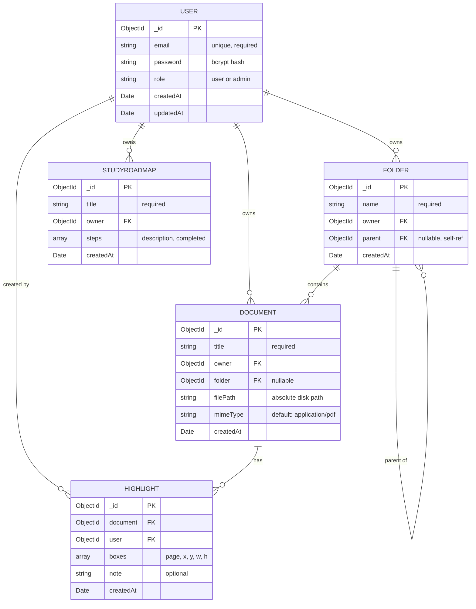
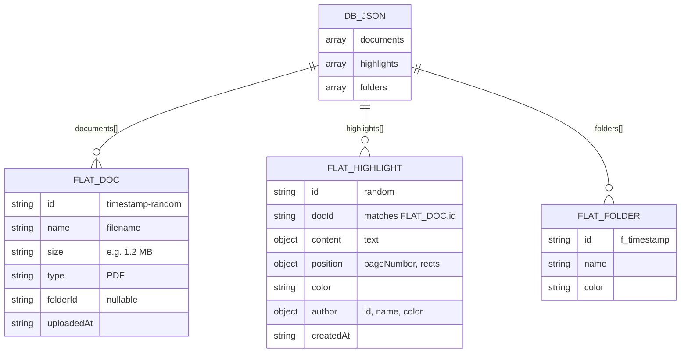

# 05 — Database Schema

## Plain-English Overview

Nexal uses two completely separate data stores: a MongoDB database with five Mongoose models for the authenticated backend, and a flat JSON file (`data/db.json`) used by the Next.js API routes for the AI workspace. These two stores are never in sync — a document created in one is invisible to the other.

---

## ER Diagram — MongoDB Models



---

## Flat-File Schema — `data/db.json`



> **Key gap:** `FLAT_DOC.id` and MongoDB `DOCUMENT._id` are completely different ID systems with no link between them.

---

## Code Walk-Through

### User Model — `backend/src/models/User.js`

```js
const UserSchema = new mongoose.Schema({
  email: { type: String, required: true, unique: true },
  password: { type: String, required: true },
  role: { type: String, enum: ['user', 'admin'], default: 'user' },
}, { timestamps: true });
```

- `unique: true` — creates a MongoDB unique index; duplicates rejected at DB level.
- `enum: ['user', 'admin']` — restricts field to those values.
- `{ timestamps: true }` — auto-adds `createdAt` and `updatedAt`.

### Document Model — `backend/src/models/Document.js`

```js
const DocumentSchema = new mongoose.Schema({
  title: { type: String, required: true },
  owner: { type: mongoose.Schema.Types.ObjectId, ref: 'User', required: true },
  folder: { type: mongoose.Schema.Types.ObjectId, ref: 'Folder', default: null },
  filePath: { type: String, required: true },
  mimeType: { type: String, default: 'application/pdf' },
}, { timestamps: true });
```

- `mongoose.Schema.Types.ObjectId` with `ref: 'User'` — enables `.populate('owner')` to fetch the full User document. Without `.populate()`, only the raw ObjectId is returned.
- `filePath` — absolute path on disk. Becomes a dangling reference if the file is deleted without updating MongoDB.

### Folder Model — `backend/src/models/Folder.js`

```js
const FolderSchema = new mongoose.Schema({
  name: { type: String, required: true },
  owner: { type: mongoose.Schema.Types.ObjectId, ref: 'User', required: true },
  parent: { type: mongoose.Schema.Types.ObjectId, ref: 'Folder', default: null },
}, { timestamps: true });
```

`parent` references another Folder — a self-referential relationship for nested folders. `parent: null` = root folder.

### Highlight Model — `backend/src/models/Highlight.js`

```js
const HighlightSchema = new mongoose.Schema({
  document: { type: mongoose.Schema.Types.ObjectId, ref: 'Document', required: true },
  user: { type: mongoose.Schema.Types.ObjectId, ref: 'User', required: true },
  boxes: [{ page: Number, x: Number, y: Number, width: Number, height: Number }],
  note: { type: String },
}, { timestamps: true });
```

`boxes` is an embedded array of sub-documents. **Note:** This model is defined and has backend routes, but the frontend workspace uses the Next.js `/api/highlights` → `db.json` path instead. This model is currently unused by the UI.

### StudyRoadmap Model — `backend/src/models/StudyRoadmap.js`

```js
const StudyRoadmapSchema = new mongoose.Schema({
  title: { type: String, required: true },
  owner: { type: mongoose.Schema.Types.ObjectId, ref: 'User', required: true },
  steps: [{ description: String, completed: { type: Boolean, default: false } }],
}, { timestamps: true });
```

Backend model and routes exist. No frontend UI. Planned feature placeholder.

### db.json read/write pattern — Next.js routes

```ts
const DB_FILE = path.join(process.cwd(), "data", "db.json");
function getDB() {
  if (!fs.existsSync(DB_FILE)) {
    fs.writeFileSync(DB_FILE, JSON.stringify({ highlights: [] }, null, 2));
    return { highlights: [] };
  }
  return JSON.parse(fs.readFileSync(DB_FILE, "utf-8"));
}
// Write: read → modify → write entire file back
db.documents.push(newDoc);
fs.writeFileSync(DB_FILE, JSON.stringify(db, null, 2));
```

This is a read-modify-write cycle on a single JSON file. Concurrent requests can cause a race condition where one write overwrites another.

---

## Concepts

> **Schema**
> A schema is a contract defining the shape of your data — field names, types, required/optional, and constraints. Without schemas, any object in any shape could be stored, making queries unreliable. Mongoose schemas are enforced before data reaches MongoDB; MongoDB itself is "schemaless" — Mongoose adds the schema layer in application code.

> **ObjectId and References**
> MongoDB generates a unique 12-byte `_id` (shown as 24-char hex) for every document. When one document references another (Document → User), you store the `_id`. This is MongoDB's version of a foreign key — but unlike SQL, MongoDB does not enforce referential integrity. A deleted User leaves orphaned ObjectIds in Document records without any error.

> **Embedded vs Referenced Documents**
> Embedding stores sub-documents inside the parent (like `steps` in StudyRoadmap). Referencing stores an ObjectId pointing to another collection. Embedding is faster for reads (one query gets everything) but harder to update independently. Referencing is more flexible but requires a second query or `.populate()` to fetch the related data.

> **ODM (Mongoose)**
> Mongoose is an Object-Document Mapper for MongoDB. Instead of raw MongoDB queries, you define JavaScript classes (schemas + models) and call methods like `User.findOne({ email })` or `doc.save()`. Mongoose adds validation, type coercion, hooks, and virtual properties on top of the raw driver.

---

## Why This Way, Not Another Way

| Decision | Built | Alternative | Trade-off |
|---|---|---|---|
| Two separate schemas | MongoDB + db.json | MongoDB for everything | db.json is zero-config locally; breaks on Vercel |
| filePath in Document | Absolute path string | Store in S3, save URL | Simple; breaks if server moves or file is deleted separately |
| Embedded `steps` in Roadmap | Array of sub-documents | Separate Steps collection | Simple for small arrays; limits querying individual steps |
| Self-referential Folder | `parent: ObjectId → Folder` | Materialized path pattern | Simple to model; requires recursive queries for full tree traversal |

---

## Likely Interview Questions

**Q: What's the difference between MongoDB and a SQL database?**
> MongoDB stores documents (JSON-like objects) in collections rather than rows in tables. There's no fixed schema enforced by the database — two documents in the same collection can have different fields. Relationships are expressed by embedding sub-documents or referencing ObjectIds, rather than JOIN operations. MongoDB is better for flexible or hierarchical data; SQL is better for highly relational data with complex joins and strict consistency requirements.

**Q: What does `ref: 'User'` do?**
> It tells Mongoose which collection to look in when `.populate()` is called. Without calling `.populate('owner')`, querying a Document returns just the raw ObjectId for `owner`. With `.populate('owner')`, Mongoose does a second query to `users` and replaces the ObjectId with the full User object. The `ref` itself creates no database constraint — it's metadata for Mongoose.

**Q: Why does the Highlight model exist in MongoDB if highlights are stored in db.json?**
> The MongoDB Highlight model was built as part of the planned backend architecture. The frontend workspace evolved separately and used a simpler Next.js API route for speed. They were never unified — the MongoDB model and routes exist but the frontend never calls them. This is the same root cause as the two-upload-system problem.

**Q: What's wrong with the db.json approach at scale?**
> Three problems: First, the read-modify-write cycle has a race condition — two concurrent writes can corrupt the file. Second, the whole file is loaded into memory on every read — impractical for thousands of documents. Third, on platforms like Vercel, the filesystem is ephemeral — the file is lost between deployments. A real database handles concurrency, scales to millions of records, and persists independently of the server.
