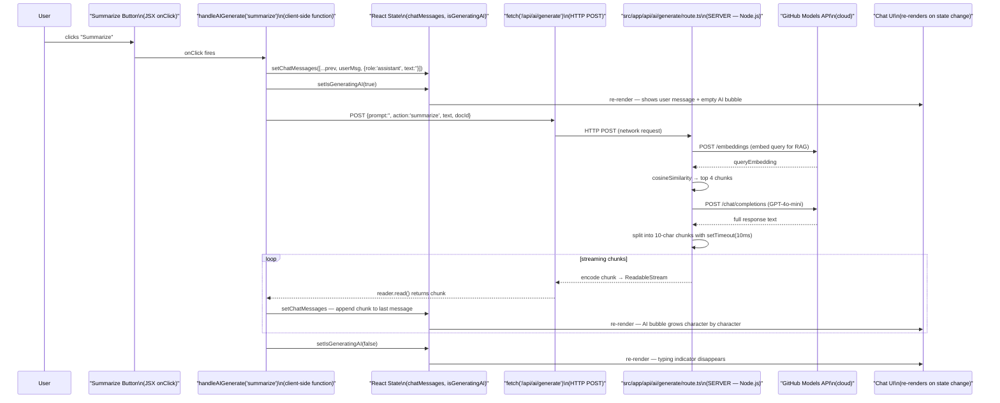
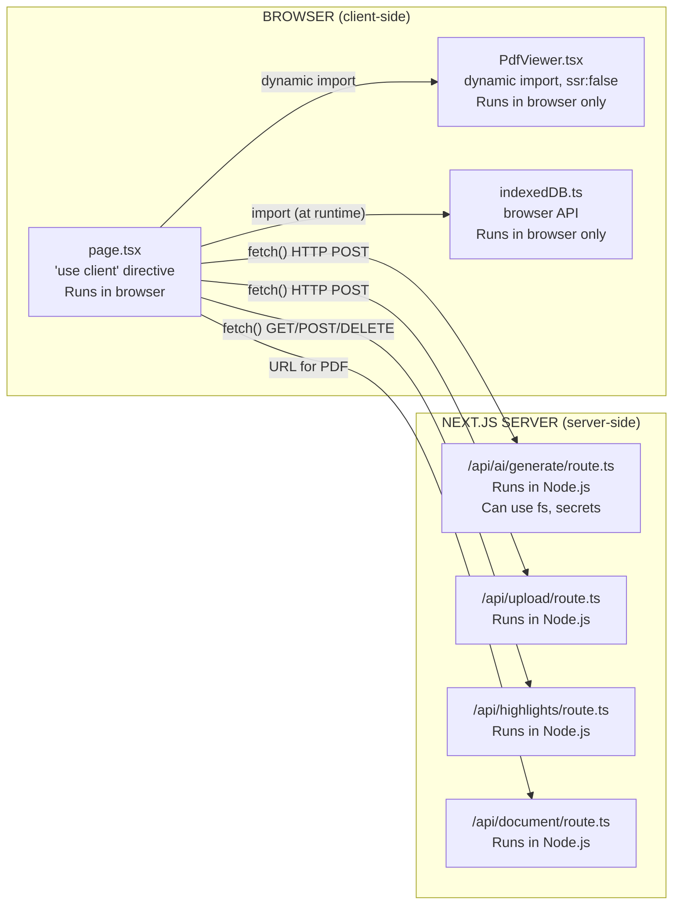

# 06 — Frontend Data Flow

## Plain-English Overview

When a user clicks "Summarize" in the workspace, a React event handler reads state, calls a Next.js API route, streams the response back, and updates the chat UI character by character — all without a page reload. Understanding this flow means understanding React state, async `fetch`, readable streams, and the difference between client-side and server-side code in Next.js.

---

## Diagram: "Summarize" Click — Full Flow



---

## What Runs Where in Next.js



> **Rule:** Files with `"use client"` at the top run in the browser. Files in `src/app/api/` run on the Node.js server — they have access to `fs`, `process.env` secrets, and Node APIs. The browser cannot access these directly.

---

## Code Walk-Through

### The "use client" directive — `src/app/workspace/[id]/page.tsx:1`

```ts
"use client";
```

This single string at the top of the file tells Next.js to ship this component to the browser as JavaScript. Without it, Next.js would try to render it on the server (server component), where browser APIs like `useState`, `useEffect`, `window`, and IndexedDB don't exist.

### React State declaration — lines 21–39

```ts
const [activeTab, setActiveTab] = useState("Notes");
const [chatMessages, setChatMessages] = useState<{role: string, text: string}[]>([]);
const [isGeneratingAI, setIsGeneratingAI] = useState(false);
const [chatInput, setChatInput] = useState("");
const [highlights, setHighlights] = useState<any[]>([]);
```

Each `useState` call creates a piece of state with a getter and setter. React re-renders the component every time a setter is called with a new value. This is how the UI stays in sync with data — React "reacts" to state changes.

### The handleAIGenerate function — lines 152–219

```ts
const handleAIGenerate = async (action: string) => {
  const targetHighlight = highlights.find(h => h.id === activeHighlightId) || highlights[0];
  if (!targetHighlight || !targetHighlight.content?.text) {
    alert("Please select a highlight with text first!");
    return;
  }
  const text = targetHighlight.content.text;
  setActiveTab("Chat");

  // Optimistic UI update — add user message and empty AI placeholder immediately
  const userMsg = { role: "user", text: `Please ${action} this text: "${text}"` };
  setChatMessages(prev => [...prev, userMsg, { role: "assistant", text: "" }]);
  setIsGeneratingAI(true);

  try {
    const res = await fetch("/api/ai/generate", {
      method: "POST",
      headers: { "Content-Type": "application/json" },
      body: JSON.stringify({ prompt: "", action, text, docId })
    });
    if (!res.body) return;
    const reader = res.body.getReader();
    const decoder = new TextDecoder();
    let done = false;
    while (!done) {
      const { value, done: doneReading } = await reader.read();
      done = doneReading;
      const chunkValue = decoder.decode(value);
      setChatMessages(prev => {
        const newMessages = [...prev];
        const lastIndex = newMessages.length - 1;
        newMessages[lastIndex] = { ...newMessages[lastIndex], text: newMessages[lastIndex].text + chunkValue };
        return newMessages;
      });
    }
  } catch(e) {
    console.error(e);
  } finally {
    setIsGeneratingAI(false);
  }
};
```

Key concepts in this function:
- **Optimistic UI:** The user message and empty AI bubble are added to state *before* the API call. The UI feels instant.
- **`setChatMessages(prev => [...prev, ...])`:** Uses the functional updater form. `prev` is the current state value — safer than capturing `chatMessages` directly in the closure.
- **`res.body.getReader()`:** Reads the HTTP response body as a stream. Each `reader.read()` call returns the next available chunk.
- **`new TextDecoder().decode(value)`:** Converts `Uint8Array` bytes to a string.
- **`newMessages[lastIndex].text + chunkValue`:** Appends each chunk to the last message in state, making the text grow progressively.

### handleSendChat — lines 221–285

Same streaming pattern as `handleAIGenerate`, but uses the user's chat input:
```ts
const contextText = targetHighlight ? targetHighlight.content?.text || "" : "";
body: JSON.stringify({ prompt: currentInput, action: "chat", text: contextText, docId })
```

If no highlight is selected, `contextText` is `""` — the AI relies entirely on RAG-retrieved chunks.

### Dynamic import of PdfViewer — line 14

```ts
const PdfViewer = dynamic(() => import("../PdfViewer"), {
  ssr: false,
  loading: () => <div>Loading Document Viewer...</div>
});
```

`ssr: false` tells Next.js not to render this component on the server. `react-pdf-highlighter` uses browser APIs (canvas, DOM) that don't exist in Node.js. Without `ssr: false`, server-side rendering would throw an error. The component loads only after the browser has mounted.

### Socket.io connection — lines 397–447 (in `useEffect`)

```ts
useEffect(() => {
  const socket = io(process.env.NEXT_PUBLIC_API_URL || "http://localhost:5000");
  socketRef.current = socket;
  socket.on("connect", () => socket.emit("join-document", { documentId: docId, user }));
  socket.on("receive-highlight", (data) => {
    setHighlights(prev => {
      if (prev.find(h => h.id === data.highlight.id)) return prev; // deduplicate
      return [...prev, { ...data.highlight, author: data.user }];
    });
  });
  return () => { socket.disconnect(); }; // cleanup on unmount
}, [docId]);
```

`useEffect` runs after the component first renders (and again if `docId` changes). The cleanup function returned from `useEffect` runs when the component unmounts — disconnecting the socket to prevent memory leaks. `socketRef.current` stores the socket instance between re-renders without triggering re-renders (a ref, not state).

### Conditional rendering — throughout JSX

```tsx
{activeTab === "Chat" && (
  <div className="...">
    {chatMessages.map((msg, idx) => (
      <div key={idx} className={`... ${msg.role === 'user' ? 'bg-[#222]' : 'bg-emerald-500/10'}`}>
        {msg.role === 'user' ? msg.text : renderMarkdown(msg.text)}
      </div>
    ))}
    {isGeneratingAI && <div className="animate-pulse">AI is typing...</div>}
  </div>
)}
```

`&&` short-circuits — the entire Chat tab JSX only renders when `activeTab === "Chat"`. `isGeneratingAI` controls whether the typing indicator shows. This is how React UI stays in sync with state without manual DOM manipulation.

---

## Concepts

> **React State**
> State is data that, when changed, causes React to re-render the component and update the DOM. `useState(initialValue)` returns `[currentValue, setter]`. Calling the setter with a new value triggers a re-render. State is local to the component instance — each open workspace tab has its own independent state.

> **async/await**
> JavaScript is single-threaded — it can only do one thing at a time. `async/await` is syntax for handling asynchronous operations (like network requests) without blocking the thread. `await fetch(...)` pauses execution of the current function until the HTTP response arrives, but the thread is free to handle other events meanwhile. Without `async/await`, you'd chain `.then()` callbacks — same behavior, less readable.

> **ReadableStream / Streaming Responses**
> An HTTP response body is normally buffered — you receive all of it at once. A streaming response sends data incrementally. `res.body.getReader()` gives you a `ReadableStreamDefaultReader` that you call `.read()` on in a loop, receiving chunks as they arrive. This is how the AI text appears to type progressively — each chunk of 10 characters is appended to state as it arrives.

> **Client-side vs Server-side in Next.js**
> Next.js runs in two environments. **Server-side** (`src/app/api/route.ts` files): runs in Node.js on the server. Has access to `fs`, `process.env` secrets, database connections. Never reaches the browser. **Client-side** (`"use client"` files): compiled to browser JavaScript. Has access to `window`, `document`, `localStorage`, React hooks. Cannot use Node.js APIs. The `fetch()` call in a client component crosses this boundary — it sends an HTTP request from the browser to the server route.

> **useEffect and Cleanup**
> `useEffect(fn, [deps])` runs `fn` after the component renders. If `deps` is `[docId]`, the effect re-runs when `docId` changes. The function can return a "cleanup" function that runs before the next effect or when the component unmounts. The Socket.io disconnect in the cleanup prevents a memory leak — without it, old socket connections would accumulate every time the user navigates to a new document.

> **useRef**
> `useRef` creates a mutable container whose `.current` property persists between renders without causing re-renders when changed. Used for the Socket.io instance (`socketRef.current`) because you need to reference it in event handlers without recreating the socket on every render.

---

## Why This Way, Not Another Way

| Decision | Built | Alternative | Trade-off |
|---|---|---|---|
| Simulated streaming | Full response fetched, then drip-fed in 10-char chunks | True streaming from GitHub Models | GitHub Models returns full responses (not SSE). Simulated streaming gives the "typing" feel without true streaming support |
| Functional state updates | `setChatMessages(prev => [...])` | `setChatMessages([...chatMessages, ...])` | Functional form uses the latest state value, avoiding stale closure bugs in async handlers |
| `ssr: false` for PdfViewer | `dynamic(() => import(...), { ssr: false })` | Detect browser APIs at runtime | Cleaner — Next.js handles the conditional entirely rather than requiring `typeof window !== 'undefined'` checks inside the component |
| `useRef` for socket | `socketRef.current = socket` | Store socket in `useState` | Storing in state would re-render the component every time the socket connects/disconnects — unnecessary |
| Optimistic UI | Add messages before API call | Wait for API response to add messages | Feels instant; if the API fails, the empty AI bubble stays (currently no error cleanup) |

---

## Likely Interview Questions

**Q: What is React state and why does changing it re-render the component?**
> State is React's mechanism for tracking data that should cause the UI to update when it changes. React maintains a fiber tree of components and their state. When you call a setter, React schedules a re-render of that component and its children. On re-render, React computes a new virtual DOM, diffs it against the previous one, and applies only the changed DOM operations. This is why `setIsGeneratingAI(true)` shows the typing indicator without you manually touching the DOM.

**Q: What's the difference between `useState` and `useRef`?**
> Both persist values between renders. `useState` triggers a re-render when the value changes — good for data that affects what's displayed. `useRef` does not trigger re-renders — good for values you need to access in handlers or effects without causing UI updates, like the Socket.io instance or a timer ID.

**Q: How does the streaming response work?**
> The server returns a `ReadableStream` with `Transfer-Encoding: chunked`. On the client, `res.body.getReader()` gives access to this stream. The `while (!done)` loop calls `reader.read()` which resolves when the next chunk arrives. Each chunk's bytes are decoded to a string and appended to the last message in state via `setChatMessages`. Since state updates trigger re-renders, the AI bubble grows visually with each chunk.

**Q: What does `"use client"` do?**
> It tells Next.js's bundler to include this file in the browser JavaScript bundle. Without it, Next.js treats components as server components — they render to HTML on the server and send no JavaScript to the browser. Server components can't use `useState`, `useEffect`, browser APIs, or event handlers. Since the workspace page needs all of those, it must be a client component.

**Q: Why is PdfViewer imported with `ssr: false`?**
> `react-pdf-highlighter` uses browser-only APIs like `canvas` and `HTMLElement` that don't exist in Node.js. If Next.js tried to render it during server-side rendering, it would throw an error. `dynamic(..., { ssr: false })` tells Next.js to skip this component during SSR and only mount it after the page loads in the browser.
