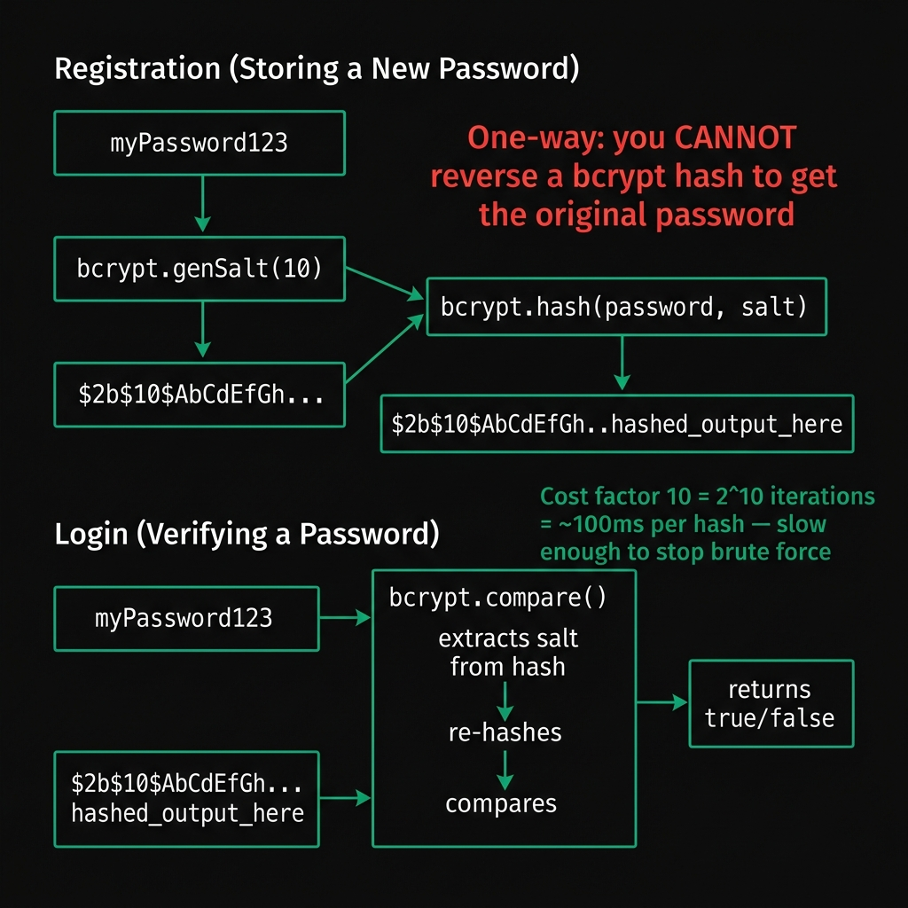
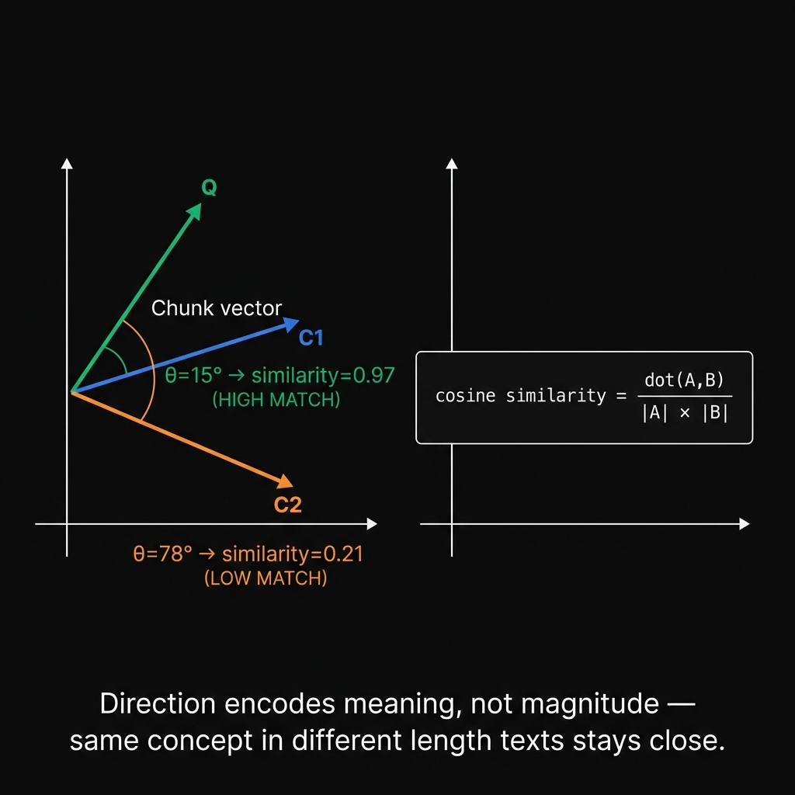
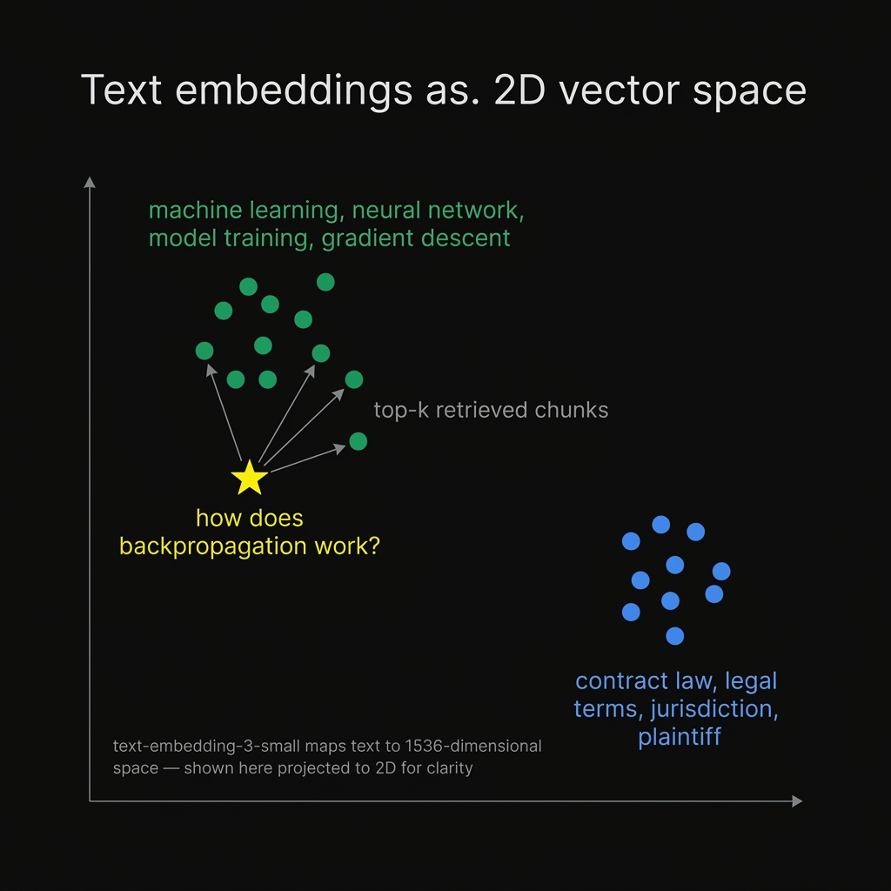
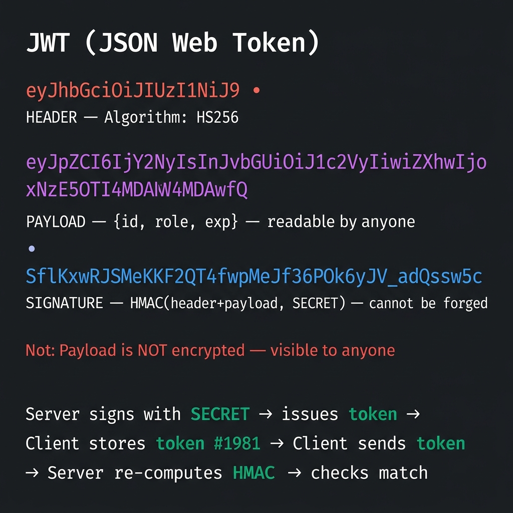

# 07 — Glossary

One-paragraph definitions of every technical term used across the documentation. All concepts are explained from first principles.

---

## API Route
An API route is a URL on a server that accepts HTTP requests and returns data (usually JSON or a stream) instead of a web page. In Next.js, any file named `route.ts` inside `src/app/api/` becomes an API route automatically — the file path maps to the URL. For example, `src/app/api/ai/generate/route.ts` handles requests to `/api/ai/generate`. API routes run on the server and have access to environment variables, the filesystem, and databases.

---

## async/await
JavaScript is single-threaded — it can only execute one instruction at a time. `async/await` is syntax for pausing a function until an asynchronous operation (like a network request or file read) completes, without freezing the entire thread. An `async` function always returns a Promise. Inside it, `await somePromise` pauses only that function's execution until the promise resolves, freeing the thread for other tasks. Without `async/await`, the equivalent code uses chains of `.then()` callbacks.

---

## bcrypt
bcrypt is a password hashing function designed specifically to be slow. Unlike general-purpose hashes (MD5, SHA-256) which can compute billions of hashes per second, bcrypt is tunable — a "cost factor" doubles compute time per increment. At cost factor 10, one hash takes ~100ms on modern hardware, making brute-force attacks impractical. bcrypt also generates a random "salt" (random bytes prepended to the password before hashing) which it embeds in the hash output, preventing two users with the same password from having the same hash and defeating precomputed lookup tables (rainbow tables).

---

## CORS (Cross-Origin Resource Sharing)
Browsers enforce a "same-origin policy" — JavaScript on `https://myapp.com` is blocked from making fetch requests to `https://api.myapp.com` (different subdomain) or `http://localhost:5000` (different port). CORS is the mechanism for a server to explicitly tell the browser "requests from these origins are allowed." The server sets `Access-Control-Allow-Origin` response headers. In this project, `backend/src/app.js` sets: `app.use(cors({ origin: process.env.CLIENT_URL }))` — only the configured frontend URL can make cross-origin requests to the Express backend.

---

## Context Window
An LLM (Large Language Model) can only process a fixed number of tokens in a single request — this limit is called the context window. GPT-4o-mini has a ~128,000 token context window. One token is roughly 3-4 characters or 0.75 words. A large PDF can easily exceed 100,000 tokens. Even when it fits, models tend to "forget" or de-prioritize content in the middle of very long inputs. RAG solves this by retrieving only the most relevant 3-4 chunks (~3,000 tokens) rather than sending the entire document.

---

## Cosine Similarity
Cosine similarity measures how similar two vectors are by computing the angle between them, regardless of their magnitude. The formula is `dot(A, B) / (|A| × |B|)`. Result ranges from -1 (opposite directions) to 1 (identical direction). In RAG, text embeddings encode meaning as direction in a high-dimensional space — two passages about the same topic point in similar directions. Cosine similarity finds which stored chunk vectors point most closely to the query vector, i.e., which chunks are most semantically related to the user's question.

---

## Embedding (Vector Embedding)
An embedding is a dense vector — a list of floating-point numbers — that represents the semantic meaning of a piece of text. Produced by a neural network trained to place texts with similar meanings close together in vector space. `text-embedding-3-small` (used in this project) produces vectors of 1536 numbers. "Machine learning" and "neural network training" would have very similar vectors. "Machine learning" and "legal contract" would have very different vectors. Embeddings are the foundation of semantic search — finding content by meaning rather than exact keyword matches.

---

## Environment Variable
An environment variable is a value stored outside the application code — in the operating system or a `.env` file — that is read by the application at startup. They hold configuration that changes between environments (development vs production) or secrets that must not be in source code (API keys, database passwords). In Node.js, environment variables are accessed via `process.env.VARIABLE_NAME`. Next.js reads from `.env.local` automatically. Variables prefixed `NEXT_PUBLIC_` are bundled into browser JavaScript (not secret). All others stay server-side only.

---

## Hashing
Hashing is a one-way transformation — a hash function takes input of any length and produces a fixed-length output (the hash/digest). The same input always produces the same hash, but you cannot reverse a hash to get the original input. Even a tiny change in input produces a completely different hash. This property makes hashing useful for passwords: the server stores only the hash, so a database breach doesn't expose real passwords. The downside: if you forget your password, it cannot be recovered — only reset.

---

## JWT (JSON Web Token)
A JWT is a compact, self-contained string for representing a claim between two parties. It has three base64url-encoded parts separated by dots: **header** (algorithm used), **payload** (user data: ID, role, expiry), **signature** (HMAC of header+payload using a secret key). The payload is readable by anyone — it's not encrypted. The signature proves the token was issued by someone who knows the secret key, making it impossible to forge. The server verifies authenticity by recomputing the HMAC — no database lookup needed per request.

---

## Middleware (Express)
In Express, middleware is a function with signature `(req, res, next)` that sits in a chain between the HTTP request arriving and the route handler responding. Each middleware can read/modify the request, respond immediately (short-circuiting the chain), or call `next()` to pass control to the next middleware. This pattern separates concerns: auth checking, request validation, and error handling are each their own middleware, reusable across routes without repeating code.

---

## multipart/form-data
The Content-Type of an HTTP request that contains binary file data. When a browser submits a file upload, it encodes the file bytes alongside any text form fields in a special format with boundary markers separating each "part." This is why normal `req.body` parsers (which handle JSON or URL-encoded data) don't work for file uploads — you need a multipart parser like multer.

---

## ORM / ODM
An ORM (Object-Relational Mapper) or ODM (Object-Document Mapper) is a library that translates between database records and JavaScript objects. Instead of writing raw database queries, you define models as JavaScript classes and call methods on them: `User.findOne({ email })`, `doc.save()`. The library handles constructing the underlying query, type coercion, and validation. Mongoose is an ODM for MongoDB — it adds schemas, hooks, and query helpers on top of the raw MongoDB driver.

---

## RAG (Retrieval-Augmented Generation)
RAG is a technique for grounding an LLM's answers in specific source documents. Without RAG, an LLM answers from its training data — it may hallucinate or give generic answers. With RAG: at upload time, documents are chunked and each chunk is embedded (converted to a vector). At query time, the user's question is also embedded, and the most semantically similar chunks are retrieved. Only those relevant chunks are injected into the LLM prompt as context. The LLM's answer is then grounded in actual document content rather than general knowledge.

---

## React State
State is data managed by a React component that, when changed, causes the component to re-render and update the UI. Declared with `useState(initialValue)` which returns `[currentValue, setter]`. The setter queues a re-render — React recomputes the component's JSX, diffs it against the previous render, and applies only the changed DOM operations. State is isolated per component instance — two different workspace tabs have completely independent state.

---

## REST API
REST (Representational State Transfer) is a convention for designing HTTP APIs. Resources are identified by URLs (`/api/documents/123`). Operations are expressed by HTTP methods: GET (read), POST (create), PUT/PATCH (update), DELETE (delete). Responses are typically JSON. The server is stateless — each request contains all the information needed to handle it (no server-side session). The codebase uses REST conventions in the Express backend routes.

---

## Schema
A schema is a formal definition of the structure, types, and constraints of data. A Mongoose schema defines which fields a MongoDB document can have, their JavaScript types (String, Number, ObjectId), whether they're required, default values, and validation rules. Without a schema, any object could be stored — schemas enforce consistency. Mongoose schemas exist in JavaScript code and are enforced by Mongoose before data reaches MongoDB; MongoDB itself is schemaless at the database level.

---

## Socket.io / WebSocket
HTTP is a request-response protocol — the client asks, the server responds, and the connection closes. WebSockets create a persistent, bidirectional connection that stays open. Either side can send messages at any time. Socket.io is a library built on top of WebSockets that adds rooms (groups of sockets), events (named messages), and automatic reconnection. In this project, Socket.io is used to broadcast highlights in real time — when one user adds a highlight, the server pushes it to everyone else viewing the same document without them having to poll the server.

---

## Streaming Response (ReadableStream)
Normally, a server assembles the entire response body and sends it at once. A streaming response sends the body in chunks incrementally. The HTTP `Transfer-Encoding: chunked` header signals this. In the browser, `response.body.getReader()` gives access to a `ReadableStream` — a reader that yields each chunk as it arrives. This project uses streaming to show the AI's response appearing progressively (though the response is actually fully fetched then artificially drip-fed in 10-character chunks with `setTimeout`).

---

## Vector / Vector Database
A vector is an ordered list of numbers — in this context, a 1536-dimensional floating-point array representing the meaning of a text chunk. A vector database is a storage system optimized for finding the vectors most similar to a query vector. Standard databases (SQL, MongoDB) are optimized for exact matches and range queries. Vector databases use special index structures (HNSW, IVF) to find approximate nearest neighbors in high-dimensional space efficiently. This project uses plain JSON files with linear scan instead — sufficient for small scale, with a clear upgrade path to pgvector or Pinecone.

---

## useEffect (React)
`useEffect(fn, [deps])` runs a side effect after a React component renders. A "side effect" is anything that reaches outside the component — network requests, subscriptions, timers, DOM manipulation. The `deps` array controls when the effect re-runs: empty `[]` means run once on mount, `[docId]` means re-run when `docId` changes. The returned cleanup function runs before the next effect or when the component unmounts — used here to disconnect Socket.io when leaving the workspace.

---

## useRef (React)
`useRef(initialValue)` creates a mutable container whose `.current` property persists between renders without causing re-renders when changed. Unlike state, updating a ref doesn't trigger a re-render. Useful for: storing a value that needs to be accessed inside event handlers without stale closure issues (like the Socket.io instance), or for accessing DOM elements directly (`ref.current.requestFullscreen()`).
