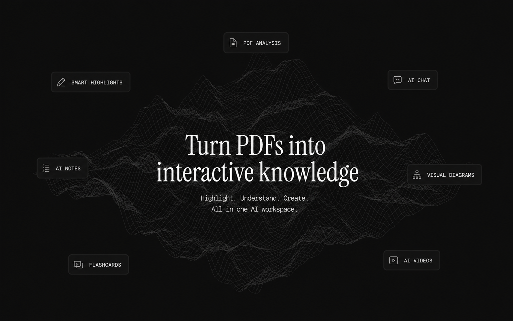
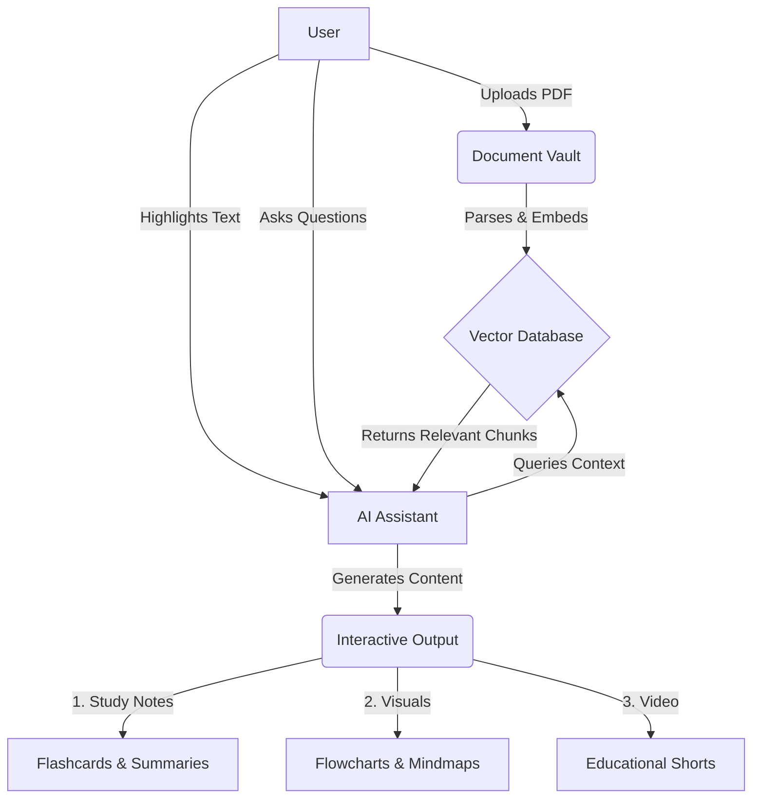

# Nexel: AI-Powered Learning Workspace 🚀

Nexel is a next-generation workspace platform designed to transform static PDFs into interactive, AI-driven knowledge. Stop reading passively and start mastering your material with instant AI notes, dynamic visual diagrams, and document-based conversations.

## Key Features

- **AI Notes from Highlights:** Simply highlight any text in your PDF. Our AI instantly generates concise summaries, bullet points, simplified explanations, and revision notes.
- **Chat with Documents:** Ask questions directly to your uploaded documents and get instant answers backed by semantic search and vector embeddings.
- **Visual Learning:** Automatically convert complex paragraphs into flowcharts, mindmaps, and simple diagrams to understand relationships visually.
- **AI Video Generation (Experimental):** Turn your notes into short educational videos with auto-generated scripts, scene splitting, and animated captions.

## Overview



## User Workflow



## Getting Started

First, run the development server:

```bash
npm run dev
# or
yarn dev
# or
pnpm dev
# or
bun dev
```

Open [http://localhost:3000](http://localhost:3000) with your browser to see the result.
