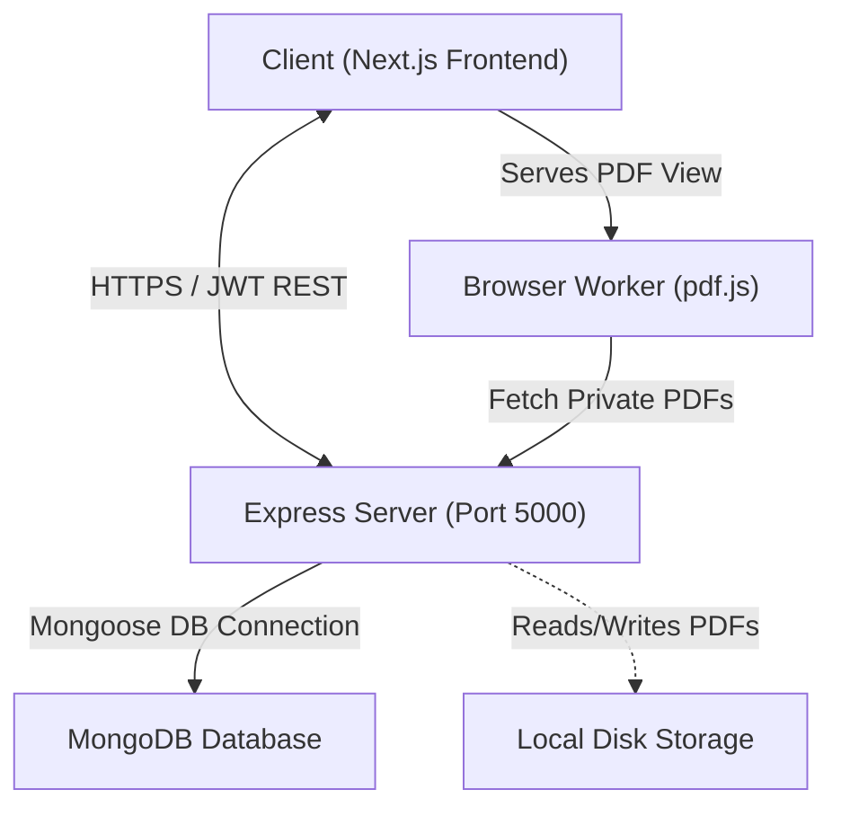

# Nexel System Architecture Document

This document outlines the design patterns, component divisions, and trade-offs of the Nexel Express-MongoDB backend system.

---

## 1. System Topology

---

## 2. Component Boundaries

### 2.1 Next.js Frontend
* Displays UI pages, workspace overlays, and chat consoles.
* Houses Mozilla's `pdf.js` worker thread, drawing high-resolution text highlights using relative CSS viewport boundaries.
* Accesses backend routes by forwarding a bearer JWT in HTTP `Authorization` headers.

### 2.2 Express API Server
* Handles RESTful routing and input validation.
* Signs and verifies JWT authorization tokens.
* Streams binary PDF files from disk to the browser.
* Streams external AI responses chunk-by-chunk using Node `ReadableStreams`.

### 2.3 MongoDB Database
* Houses documents representing `User`, `Folder`, `Document`, `Highlight`, and `StudyRoadmap` entities.
* Maintains database-level integrity, unique index constraints, and cascading deletions.

---

## 3. Technology Trade-off Rationales

### 3.1 Node.js/Express vs. Django/Python
* **Single Language Consistency**: Standardizing on JavaScript/TypeScript across frontend and backend allows shared interfaces, rapid context switching, and simpler testing.
* **Non-blocking Event Loop**: Node.js handles massive concurrency using lightweight OS callbacks. Traditional Python platforms spin up heavy threads or processes per request, resulting in high memory consumption.

* **OS callbacks**: The event loop registers callbacks with the OS (e.g., epoll, kqueue, IOCP). When I/O completes, the OS signals the loop to invoke the callback, enabling non‑blocking concurrency.
* **Thread pool for CPU work**: Node offloads CPU‑intensive tasks to libuv’s thread pool, while I/O remains callback‑driven.

### 3.2 MongoDB vs. SQL (PostgreSQL)
* **Dynamic Documents**: Text highlight dimensions and coordinate bounding boxes vary. Storing highlights as structured subdocuments or referenced documents with flexible schema capabilities is faster than creating heavily joined relational models.
* **Rapid Iteration**: AI learning plans, notes, and checklist objects are subject to rapid requirements changes. Schemaless document structures allow schema migration without database lockdowns.

### 3.3 JWT Authentication vs. Stateful Sessions
* **Horizontal Scalability**: Stateless JWT credentials reside on the client. The backend server verifies signatures mathematically using a secret key without querying a database or memory store (like Redis) on every single request.
* **Trade-off**: Revocation of compromised keys is difficult until expiration. We mitigate this by using a short expiration window (1 hour) and planning for blacklisting in security-heavy iterations.
