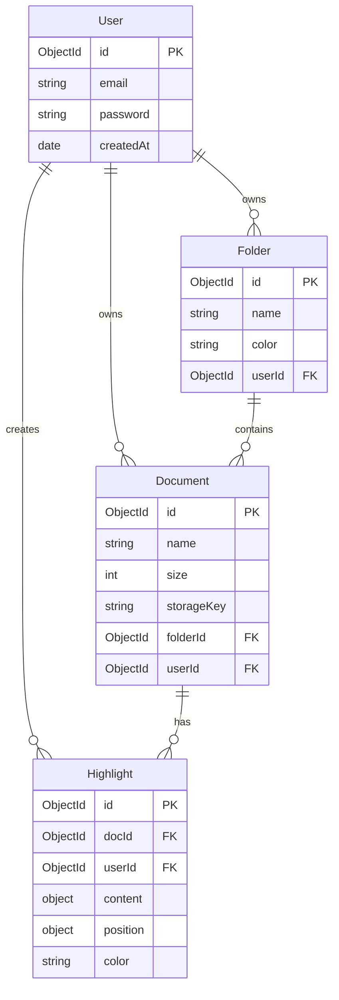

# Nexel Database Design Specification

This document defines the schema designs, indexes, database constraints, and relationships for MongoDB using Mongoose.

---

## 1. Relational Map



---

## 2. Collection Schemas

### 2.1 Users Collection (`users`)
Stores core identity data. Password strings are hashed representation from `bcryptjs`.

```typescript
const UserSchema = new Schema({
  email: {
    type: String,
    required: true,
    unique: true,
    trim: true,
    lowercase: true,
    index: true // Unique Index
  },
  password: {
    type: String,
    required: true
  }
}, { timestamps: true });
```

### 2.2 Folders Collection (`folders`)
Organizes study workspaces.

```typescript
const FolderSchema = new Schema({
  name: {
    type: String,
    required: true,
    trim: true
  },
  color: {
    type: String,
    default: "gray"
  },
  userId: {
    type: Schema.Types.ObjectId,
    ref: "User",
    required: true,
    index: true // Compound query performance
  }
}, { timestamps: true });
```

### 2.3 Documents Collection (`documents`)
Tracks metadata of files. PDF binary content is kept on disk, not in the database.

```typescript
const DocumentSchema = new Schema({
  name: {
    type: String,
    required: true
  },
  size: {
    type: Number,
    required: true
  },
  storageKey: {
    type: String,
    required: true // Points to physical file name on disk
  },
  folderId: {
    type: Schema.Types.ObjectId,
    ref: "Folder",
    default: null,
    index: true
  },
  userId: {
    type: Schema.Types.ObjectId,
    ref: "User",
    required: true,
    index: true
  }
}, { timestamps: true });
```

### 2.4 Highlights Collection (`highlights`)
Coordinates annotations.

```typescript
const HighlightSchema = new Schema({
  docId: {
    type: Schema.Types.ObjectId,
    ref: "Document",
    required: true,
    index: true // Fast highlights loading
  },
  userId: {
    type: Schema.Types.ObjectId,
    ref: "User",
    required: true
  },
  content: {
    text: { type: String, required: true },
    comment: { type: String, default: "" }
  },
  position: {
    boundingRect: {
      x1: Number,
      y1: Number,
      x2: Number,
      y2: Number,
      width: Number,
      height: Number
    },
    rects: [{
      x1: Number,
      y1: Number,
      x2: Number,
      y2: Number,
      width: Number,
      height: Number
    }],
    pageNumber: { type: Number, required: true }
  },
  color: {
    type: String,
    default: "yellow"
  }
}, { timestamps: true });
```

---

## 3. Indexes & Queries Optimization

1. **Unique Email Index**: `users.createIndex({ email: 1 }, { unique: true })`. Ensures zero email duplicates and runs login lookups in O(log N) time rather than O(N) full table scans.
2. **Compound Index on User Documents**: `documents.createIndex({ userId: 1, folderId: 1 })`. Speeds up page loads when retrieving documents organized inside user folders.
3. **Foreign Key Indexing**: `highlights.createIndex({ docId: 1 })`. Allows rapid loading of text highlights when a user opens a document.
