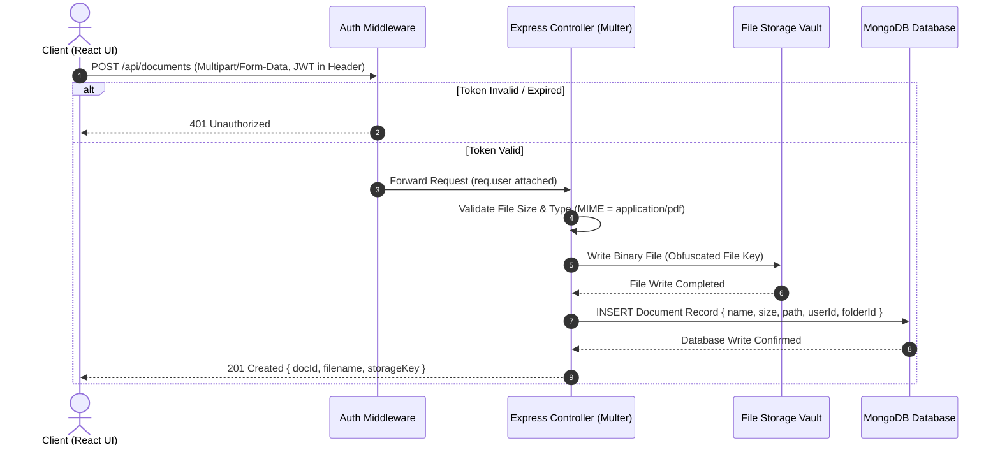
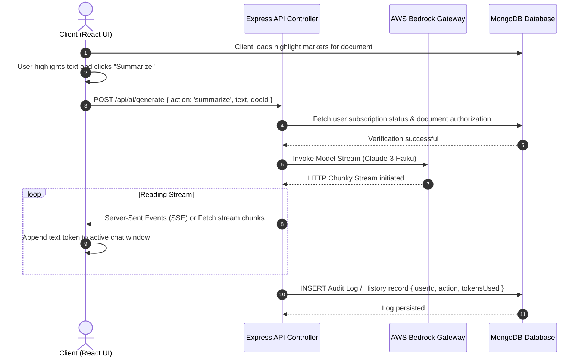

# Nexel: System Architecture & Design Specification (Phase 2 Masterclass)

This document establishes the architectural foundation for the rebuilt **Nexel** application. It serves as a study guide for software engineering interviews, detailing system component boundaries, technology trade-offs, and critical database/API decisions.

---

## 1. System Responsibility Boundaries

In a production system, a clean separation of concerns ensures that the platform is **scalable, secure, maintainable, and testable**. The architecture of Nexel is divided into four primary tiers:

```
+-----------------------------------------------------------------------------------+
|                                 SYSTEM VIEWPORT                                   |
|                                                                                   |
|  [ Client Browser ] <---(HTTPS / SSE / REST)---> [ Express Backend ]             |
|          |                                              |                         |
|          | (Binary)                                     | (TCP / Driver)          |
|          v                                              v                         |
|  [ File Storage Layer ]                       [ Database Engine ]                 |
|  (Local Storage / AWS S3)                     (MongoDB Atlas)                     |
|                                                         |                         |
|                                                         v                         |
|                                                [ AWS Bedrock AI ]                 |
+-----------------------------------------------------------------------------------+
```

### 1.1 Frontend Responsibilities (Client Tier)
* **Single Page Application (SPA) Rendering**: Manage responsive UI viewports (landing, storage dashboards, workspace split panes) using Next.js client components.
* **Natively Render PDFs**: Execute Mozilla's `pdf.js` inside the browser sandbox using web workers to parse and render binary PDF canvases without locking the main thread.
* **Coordinate Highlight Interception**: Catch mouse events, resolve text selection boundaries via the browser's Selection API (`window.getSelection()`), and calculate bounding boxes (`getBoundingClientRect`) relative to active PDF page viewports.
* **State & Session Context Persistence**: Maintain active state scopes (e.g. current document, expanded folder lists, active highlight overlay selections) and store the JWT authentication token securely in client-side memory or cookie wrappers.
* **Payload Stream Processing**: Intercept token chunks from backend AI handlers using the browser `ReadableStream` API, updating message arrays in real-time.

### 1.2 Backend Responsibilities (Application Tier)
* **Authentication Gateway**: Manage user signup/login, encrypt credentials using `bcryptjs`, and generate and sign state-free JSON Web Tokens (JWT) for secure, stateless request authentication.
* **REST API Endpoint Controllers**: Provide resource routes (`/api/auth`, `/api/documents`, `/api/folders`, `/api/highlights`, `/api/ai`) with strict input validation, routing requests, parsing payloads, and returning correct HTTP status codes.
* **File Upload Orchestration & Staging**: Handle incoming multipart/form-data PDF uploads, enforce size and MIME boundaries (e.g., maximum 10MB PDF files), obfuscate filenames, and store them securely.
* **AI Provider Proxy**: Formulate system prompts, append context ranges, sign credentials securely using environment variables, and proxy requests to AWS Bedrock, transforming the downstream payload into a serverless HTTP stream.

### 1.3 Database Responsibilities (Persistence Tier)
* **Metadata Relational Indexing**: Store structured object models representing system entities (Users, Folders, Documents, Highlights).
* **Reference Relationships**: Maintain relationships (e.g., `User` has many `Folders`, `Folder` has many `Documents`, `Document` has many `Highlights`) with strict key constraints.
* **Query Performance Optimization**: Apply strategic indexes (e.g. index on `docId` in the Highlights collection) to prevent slow table scans when fetching annotations.
* **Data Integrity Maintenance**: Implement cascade deletion rules (e.g., deleting a Document must trigger automated cascade deletion of all its corresponding Highlights) to prevent database bloat.

### 1.4 File Storage Responsibilities (Storage Tier)
* **Raw Binary Staging**: House and isolate binary PDF objects away from public assets.
* **Security & Path Obfuscation**: Enforce server-level validation checks (e.g. checking permission maps before serving a file stream) and prevent Directory Traversal Attacks.
* **Scalable Delivery**: Stream large binary assets chunk-by-chunk using node `ReadableStreams` rather than buffer-loading the entire file into memory before writing to the response.

---

## 2. System Architecture Diagrams

### 2.1 Complete Request-Response Lifecycle for PDF Uploads
This sequence shows the progression of a multipart file upload, highlighting how the frontend, backend, database, and storage subsystems cooperate.



### 2.2 Text Highlighting & AI Streaming Flow
This sequence shows how client selection coordinate annotations are persisted and piped to Bedrock for token-by-token streaming.



---

## 3. Technology Recommendations, Trade-Offs, and Interview Prep

For every technical decision in a system design interview, a Staff Engineer must justify *why* a technology was selected, what alternatives exist, and what trade-offs were made.

---

### 3.1 Why Express (Node.js)?

#### Comparison Matrix

| Runtime / Framework | Concurrency Model | Async I/O Native? | Developer Velocity | Ecosystem Size |
| :--- | :--- | :--- | :--- | :--- |
| **Express (Node.js)** | Single-Threaded Event Loop (libuv) | Yes (Event driven) | Extremely High (JS/TS) | Dominant (npm) |
| **Spring Boot (Java)** | Thread-per-request / Virtual Threads | Optional (WebFlux) | Moderate (Boilerplate) | Large (Enterprise) |
| **FastAPI (Python)** | Event Loop (uvicorn) | Yes | High | Large (Data/AI) |
| **Go (Gin)** | Multi-Threaded Goroutines | Yes | High | Medium |

#### Why Chosen
* **Single Language Synergy**: Building the backend in Node.js allows us to use TypeScript end-to-end, sharing type interfaces (e.g. schema types, API Request/Response shapes) between frontend and backend.
* **I/O Bound Architecture**: Nexel's workload is heavily I/O bound (uploading files, querying databases, forwarding streams to AI services). Node.js is optimized for asynchronous, non-blocking I/O operations, whereas traditional multi-threaded servers waste memory keeping threads idle while waiting for disk/network processes.

#### Trade-offs
* **CPU-Bound Operations**: Node.js runs on a single thread. If we were running local PDF OCR, indexing vector databases locally, or running heavy parsing computations, Node.js would block the event loop, causing all other requests to stall.
  * *Mitigation*: We offload heavy tasks (like AI processing) to AWS Bedrock and run file storage asynchronously.

#### 🎓 Placement Interview Questions
1. **Explain the Node.js Event Loop. How does it handle concurrency on a single thread?**
   * *Answer*: Node.js utilizes a single-threaded runtime engine where concurrency is managed by an Event Queue and the Event Loop (powered by the native C++ library `libuv`). When an asynchronous operation (like a database query or a file upload) is initiated, Node.js delegates the execution to the OS kernel or the internal worker thread pool. The Event Loop continues executing subsequent synchronous code without blocking. When the asynchronous operation finishes, its registered callback is pushed to the callback queue, which the Event Loop checks and executes once the main call stack is empty.
2. **What happens if a route handler contains a long-running `while(true)` loop? How does it affect other users?**
   * *Answer*: It blocks the entire event loop. Because Node.js is single-threaded, a CPU-intensive operation that executes synchronously will prevent the Event Loop from entering subsequent phases. Consequently, the server will become completely unresponsive to all other incoming HTTP requests, leading to timeouts across all clients.

---

### 3.2 Why MongoDB?

#### Comparison Matrix

| Database System | Schema Flexibility | Joins / Relations | Vertical scaling | Horizontal Scaling |
| :--- | :--- | :--- | :--- | :--- |
| **MongoDB** | Schemaless / BSON Docs | Poor (Requires lookup) | Hard | High (Sharding native) |
| **PostgreSQL** | Strict Relational Schemas | High (Native Joins) | High | Hard |
| **SQLite** | Local File DB | Native | Medium | Not Scalable |

#### Why Chosen
* **Schema Evolution**: AI features change rapidly. As we build highlights, chat history, and summaries, our database schema will evolve. MongoDB allows us to store document payloads (such as variable highlight coordinates, metadata parameters, or conversation structures) as flexible JSON/BSON records without running database migrations.
* **Hierarchical Document Model**: A document's highlights naturally fit a parent-child relationship. Instead of running expensive SQL `JOIN` statements to reconstruct highlights, we can fetch the entire document and its highlights in a single query by modeling Highlights as sub-documents or referenced documents in a collection.

#### Trade-offs
* **Lack of ACID transactions at scale**: While MongoDB supports multi-document transactions, it is not optimized for complex transactional workloads (e.g. multi-step banking ledger balances) compared to PostgreSQL.
  * *Mitigation*: Nexel is a document collaboration tool, not a financial system. Relational integrity is managed at the application logic tier using Mongoose validation.

#### 🎓 Placement Interview Questions
1. **Relational (SQL) vs. Non-Relational (NoSQL): When would you pick one over the other?**
   * *Answer*: Choose SQL (PostgreSQL, MySQL) when your application requires strict schemas, absolute transactional safety (ACID compliance), and complex multi-table joins (e.g., banking or e-commerce orders). Choose NoSQL (MongoDB, DynamoDB) when your data model is unstructured or hierarchical, when schemas change rapidly, or when you require high write throughput and native horizontal scaling (sharding).
2. **Explain the concept of Indexes in databases. How does MongoDB implement them, and what is the cost of having too many indexes?**
   * *Answer*: Indexes are specialized data structures (typically B-Trees) that store a small portion of the collection's data in a traversable form. They prevent the database engine from performing a full collection scan to find a document. In MongoDB, indexing a field like `docId` speed up queries like `find({ docId })`. The trade-off is that every index consumes memory (RAM) and slows down write operations (`INSERT`, `UPDATE`, `DELETE`) because the database must update the index tree every time data is modified.

---

### 3.3 Why JWT (JSON Web Tokens)?

#### Comparison Matrix

| Authentication Strategy | State Location | Session Revocation | Performance Cost | Scalability |
| :--- | :--- | :--- | :--- | :--- |
| **JWT (Stateless)** | Client-side storage | Difficult (Until expiry) | Low (Cryptographic check) | Infinite |
| **Session-Cookie (Stateful)** | Server-side database / Redis | Instant (Delete session) | High (DB lookup per request) | Moderate (Requires Redis) |

#### Why Chosen
* **Stateless Scaling**: JSON Web Tokens contain the user's session data encrypted/signed in the token payload itself. The server does not need to store session states in a database or lookup session records on every incoming API request. This reduces database queries and allows the backend to scale horizontally across multiple instances without sharing session state.

#### Trade-offs
* **Revocation Deficit**: Once a JWT is signed and sent to the client, it remains valid until its expiration timestamp. If a user logs out or their token is compromised, the server cannot easily invalidate the token without maintaining a database blacklist (which negates the stateless benefit).
  * *Mitigation*: We use short-lived access tokens (e.g., 15 minutes) coupled with refresh tokens stored in secure `httpOnly` cookies.

#### 🎓 Placement Interview Questions
1. **Explain the structural anatomy of a JWT.**
   * *Answer*: A JSON Web Token consists of three parts separated by dots (`.`):
     1. **Header**: Contains metadata about the token, such as the hashing algorithm used (e.g., HS256) and the type of token (JWT).
     2. **Payload**: Contains the claims (user ID, username, expiration time, scope) which are JSON-formatted and Base64Url encoded.
     3. **Signature**: Formed by taking the encoded header, encoded payload, and signing it using a secret key with the algorithm specified in the header. This prevents tempering.
2. **How does a server verify a JWT, and how does this protect against tampering?**
   * *Answer*: When the server receives a JWT in the `Authorization` header, it extracts the Header and Payload, hashes them using the server's private secret key, and compares the resulting hash with the signature attached to the token. If the signatures match and the token is not expired, the server verifies that the payload has not been tampered with.

---

### 3.4 Why REST APIs?

#### Comparison Matrix

| API Architecture | Protocol / Style | Schema Enforced | Client Flexibility | Latency Profile |
| :--- | :--- | :--- | :--- | :--- |
| **REST** | HTTP Verbs | No (Manual check) | Fixed payload responses | Low |
| **GraphQL** | POST Queries | Yes (GraphQL Schema) | High (Request exact fields) | Medium |
| **gRPC** | HTTP/2 Protobuf | Yes (Strict contract) | Fixed | Extremely Low |

#### Why Chosen
* **Industry Standard simplicity**: REST is simple to implement, debug, and test using tools like Postman or curl.
* **Resource Centric Model**: Nexel's features maps directly to standard RESTful resources (e.g., `POST /api/folders`, `GET /api/documents/:id/highlights`, `DELETE /api/highlights/:id`).
* **Caching Support**: Standard HTTP caching headers fit REST architecture natively, allowing clients to cache responses (such as folder structures or static documents) at the browser or CDN level.

#### Trade-offs
* **Over-fetching / Under-fetching**: If the client only needs a document's name, a REST GET request might return the entire document metadata payload (size, date, owner, folder parameters), wasting network bandwidth.
  * *Mitigation*: We design clean, lightweight API response structures.

#### 🎓 Placement Interview Questions
1. **Explain the difference between POST, PUT, and PATCH methods in REST.**
   * *Answer*:
     * **POST**: Used to create a new resource on the server. It is non-idempotent (running it multiple times creates multiple resources).
     * **PUT**: Used to replace an existing resource entirely or create it if it doesn't exist. It is idempotent (running it multiple times leaves the resource in the same state).
     * **PATCH**: Used to apply partial modifications to a resource (e.g. updating just the name field of a document). It is also idempotent if written correctly.
2. **What does Idempotency mean in the context of HTTP methods?**
   * *Answer*: An HTTP method is idempotent if making multiple identical requests has the same effect on the server state as making a single request. For example, `GET`, `PUT`, `DELETE` are idempotent because querying a record, replacing a record with the same state, or deleting a record multiple times produces the identical side-effects as doing it once. `POST` is not idempotent.

---

### 3.5 Why Multer?

#### Why Chosen
* **Multipart Handling**: Standard HTTP requests are encoded as URL parameters or JSON payloads. Files, however, are sent as binary streams. Multer acts as a middleware for Express that parses `multipart/form-data` uploads, streaming file chunks directly to the disk without overloading the Node.js memory heap.

#### Alternatives & Trade-offs
* **Alternatives**: `formidable` or `busboy`. While `busboy` is slightly faster as a low-level parser, Multer provides a cleaner, developer-friendly API wrapped specifically around Express middleware.
* **Trade-off**: Storing uploaded files locally on the server disk makes the application stateful. If we run multiple backend server instances behind a load balancer, files uploaded to Instance A won't be accessible by Instance B.
  * *Mitigation*: In Nexel V2, we will migrate local disk storage to a centralized object storage bucket (like AWS S3).

#### 🎓 Placement Interview Questions
1. **Why can't we upload files using a standard JSON POST request?**
   * *Answer*: Standard JSON requires text encoding. To send a binary file (like a PDF) inside a JSON payload, we would need to encode the entire file into a text format like Base64. This increases the payload size by approximately 33%, increases CPU usage for encoding/decoding, and requires the server to load the entire encoded file into memory at once, which can easily crash Node.js processes under load.
2. **What is `multipart/form-data` and how does a server process it?**
   * *Answer*: `multipart/form-data` is a MIME type that allows sending binary files and text data in a single HTTP request body. The request uses a random "boundary" string to separate different fields/files. The server reads the incoming request stream, parses these boundaries, and processes each part individually, streaming binary data chunks to a file stream on disk without keeping the entire file in RAM.

---

## 4. Architectural Summary

We have established the responsibilities and technologies for our rebuilt application:

* **Runtime**: Express (Node.js) with TypeScript.
* **Database**: MongoDB (Mongoose ORM).
* **Authentication**: Stateless JWTs with claims.
* **APIs**: Clean REST principles.
* **File Handling**: Multer streaming to local disk storage (migrating to AWS S3 later).

This architecture separates the presentation layer from the data persistence and business logic layers, laying the groundwork for our database design.
